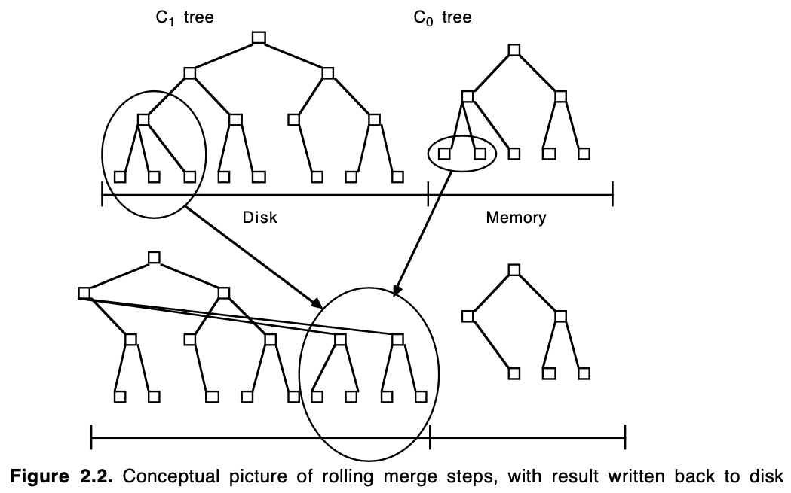
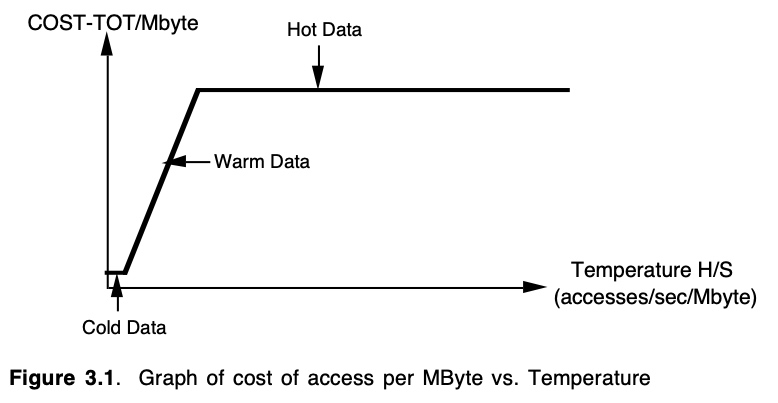
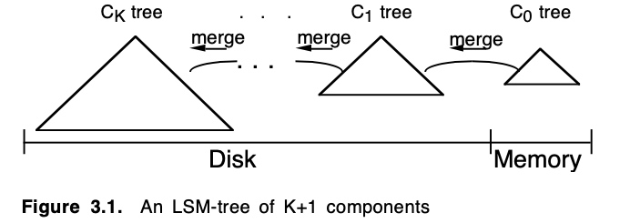
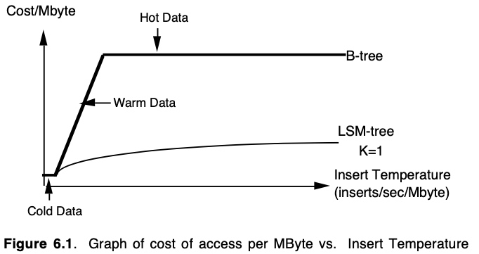

# 【论文翻译】The Log-Structured Merge-Tree (LSM-Tree)


> 译者注：有一些词汇我还是强行翻译成中文，如果读者感到费解，可以参考如下中英文对照表。另外，数据库表的名称我保留了英文，这部分应该不影响阅读体验。

| 英 | 中 |
|---|:--|
| buffer | 缓冲。内存缓冲是为了提升磁盘读写速度，将磁盘上的信息（一般是一页）读到内存中，直到过期为止，根据局部性原理，可以加快除第一次读取之外的速度。 |
| record | 记录 |
| entry | 条目 |
| rolling merge | 滚动合并 |
| multi-page disk block / multi-page block | 多页磁盘块/多页块 |
| checkpoint | 检查点 |
| long-latency finds | 长延迟查找 |
| multiblock | 多块 |
| key | 键值 |


## 摘要

高性能事务系统应用通常会在一个 History 表中插入行来追踪各种活动；同时，事务系统会生成用于系统恢复的日志记录。这两种类型的生成信息都可以从有效的索引中获益。一个众所周知的例子是 TPC-A 基准（benchmark）应用程序，它经过修改可以支持对 History 表上特定 account 的活动记录进行有效查询。这需要在快速增长的 History 表上建立一个 account-id 索引。不幸的是，标准的基于磁盘的索引结构，例如 B-tree，为了实时维护这样的索引，将会使事务的 I/O 成本增加一倍，从而导致系统的总成本增加 50%。显然，需要一种以低成本维护实时索引的方法。Log-Structured Merge-tree (LSM-tree) 是一种基于磁盘的数据结构，旨在为一个在较长时间内具有高速率记录插入（和删除）的文件提供低成本的索引。LSM-tree 使用一种算法来推迟（defer）和成批（batch）索引变更，以一种让人联想到归并排序的有效方式，将变更从一个基于内存的组件级联（cascade）到一个或多个磁盘组件。在这个过程中，所有的索引值都可以通过内存组件或其中一个磁盘组件持续地被检索到（除了非常短的锁定期）。与传统的访问方法如 B-tree 相比，该算法大大减少了磁盘臂的移动，并在传统访问方法的插入操作的磁盘臂成本超过存储介质成本的领域改善成本性能（cost-performance）。LSM-tree 的方法也适用于插入和删除以外的操作。但是，在某些情况下，需要立即响应的索引查找会降低 I/O 的效率，所以 LSM-tree 在索引插入比检索条目更常见的应用中更有用。例如，这似乎是 History 表和日志文件的一个共同属性。第 6 节的结论将 LSM-tree 访问方法中混合使用内存和磁盘组件和通常理解的混合方法在内存中缓冲（buffer）磁盘页的优势进行了比较。

## 1. 引言
 
随着活动流(activity flow)管理系统中长期(long-lived)事务的商业化([10], [11], [12], [20], [24], [27])，越来越需要提供对事务型日志记录的索引访问。传统上，对事务型日志的重点是中止和恢复，并要求系统在正常处理中参考相对近期的历史，偶尔进行事务回滚，同时恢复则通过成批地执行顺序读取。然而，随着系统负责起更复杂的活动，构成一个长期活动的事件的持续时间和数量也将增加，以至于有时需要实时回顾已经完成的事务步骤，以提醒用户已经完成了的步骤。与此同时，系统已知的活动事件总数，将增加到现有用于追踪活动日志的基于内存的数据结构将不再可行的地步，尽管可以预料到内存成本会持续下降。需要响应关于大量过去活动日志的查询意味着索引化的日志访问变得越来越重要。

即使在目前的事务型系统中，提供索引以支持对具有高插入量的历史表的查询也有明显的价值。网络、电子邮件和其他类似的事务型系统会产生大量日志，往往会损害其主机系统。为了从一个具体且众所周知的例子开始，我们在以下示例 1.1 和 1.2 中探讨了一个修改过的 TPC-A 基准。请注意，为了便于表述，本文中的示例涉及特定的参数值；将这些结果一般化是一项简单的工作。还要注意的是，虽然历史表和日志都涉及时间序列(time-series)数据，但 LSM-tree 的索引条目并不假定具有相同时间的键值顺序。提高效率的唯一假设是，与检索率(retrieval rate)相比更新率很高。

### 5 分钟法则

下面两个例子都依赖于 **5 分钟法则（the Five Minute Rule）**[13]。这个基本法则的结果表明，当页（page）引用频率超过大约每 60 秒一次时，我们可以通过购买内存缓冲区空间来将页保留在内存中以降低系统开销，从而避免磁盘 I/O。60 秒在这里只是近似值，是磁盘臂每秒一次 I/O 的平摊开销与内存每秒缓存 4KBytes 磁盘页的开销的比值。用第 3 节的数学符号来说，这个比值是 $COST_p/COST_m$ 除以页大小(M bytes)。在这里，我们只是在磁盘访问与内存缓冲区之间进行权衡，而这种权衡会带来经济收益。请注意，60 秒这个值会随着内存价格下降速度快于磁盘臂而逐年增长。但是现今 1995 年，这个值却比在 1987 年被定义时的 5 分钟要更小，部分原因是技术上的（不同的缓冲假设），部分原因是中间引入了极其廉价的大规模生产的磁盘。

**例 1.1**。考虑 TPC-A 基准[26]中假设的多用户应用，每秒执行 1000 个事务（这个速率可以扩展，但我们在下文中只考虑 1000 TPS）。每个事务会更新一列的值，从 Balance 这列中取出数额为 Delta 的行，随机选定且具有 100 字节大小的行，涉及到三个表：具有 1000 行的 Branch 表，具有 10000 行的 Teller 表，以及具有 100,000,000 行的 Account 表；该事务在提交之前，会向一个 History 表中插入一条 50 字节的记录，该记录具有如下列：Account-ID，Branch-ID，Teller-ID，Delta 和 Timestamp。

根据预测的磁盘和内存成本进行计算，Account 表的页在未来很多年内都不会是内存驻留的（见参考文献 [6]），而 Branch 和 Teller 表目前可以完全驻留在内存。根据给定的假设，对 Account 表的同一磁盘页的两次引用将间隔 2500 秒左右，远远低于 5 分钟法则所要求的缓冲区驻留频率。现在，每次事务都需要两次磁盘 I/Os，一次是读取所需的 Account 记录（我们忽略访问的页已经在缓冲区内的罕见情况），一次是写出之前的 Account 页以便在缓冲区中腾出空间进行读取（对于稳定状态是必要的）。因此，1000 TPS 将对应于大约每秒 2000 个 I/Os。按 [13] 中假定的每个磁盘臂每秒 25 次 I/Os  的额定速率，这需要 80 个磁盘臂（执行器）。在最近 8 年时间中（1987 年至 1995 年），该速率每年上升不到 10%，因此，现在的额定速率约为每秒 40 次I/O，或 50 个磁盘臂才能每秒 2000 次 I/O。根据计算，TPC 应用程序的磁盘开销约为系统总开销的一半 [6]，尽管在 IBM 大型机系统上略低一些。然而，用于支持 I/O 的开销显然是系统总开销中一个不断增长的部分，因为内存和 CPU 的成本下降速度都快于磁盘。

**例 1.2**。现在我们考虑一个有着高插入量的 History 表上的索引，可以证明这样一个索引会使 TPC 应用程序的磁盘开销加倍。一个在 “Account-ID 与 Timestamp 连接”（`Acct-ID||Timestamp`）的索引，是 History 表能够对最近 Account 活动进行高效查询的关键，例如：

``` SQL
(1.1) Select * from History
where History.Acct-ID = %custacctid
and History.Timestamp > %custdatetime;
```

如果索引 `Acct-ID||Timestamp` 不存在，这样的查询需要搜索 History 表的所有行，因此变得不可行，`Acct-ID` 索引提供了大部分的好处，但如果忽略`Timestamp`，则后面部分的成本也不会改变，所以我们假设这里使用更有效的联合索引。那么实时维护这样一个二级 B-tree 索引需要多少资源呢？我们知道 B-tree 中的节点每秒可以生产 1000 个，假设 20 天的累积时间，每天 8 小时，每个索引条目大小 16 byte，这意味着将有 576,000,000 个条目并占据 9.2 GB 的磁盘空间。即使没有浪费的空间，整个索引的叶子层大约需要 230 万页。由于事务的 `Acct-ID` 值是随机选择的，每个事务至少需要从索引读取一次页，并且在稳定状态下还需要写一次页。根据 5 分钟法则，这些索引页将不在内存缓冲区内（磁盘页读取间隔约 2300 秒），所以，所有的 I/O 都在磁盘上。在更新 Account 表已经需要 2000 次 I/O 的基础上，每秒还要增加 2000 次 I/O，这需要额外购买 50 个磁盘臂，使我们的磁盘需求增加一倍。这个数字还乐观地假设，为保持日志文件索引只有 20 天的长度，可以把删除操作作为一个批处理任务在空闲时间执行。

我们已经讨论了使用 B-tree 作为 History 文件的 `Acct-ID||Timestamp` 索引，因为它是商业系统中最常用的基于磁盘的访问方法。事实上，没有任何经典的磁盘索引结构能持续提供卓越的 I/O 成本/性能。我们将在第 5 节中讨论导致我们得出这一结论的因素。

本文提出的 LSM-tree 使我们能够使用更少的磁盘臂移动来完成 `Acct-ID||Timestamp` 索引的频繁插入，因此成本要低一个数量级。LSM-tree 使用了一种算法来推迟和成批处理索引变化，以一种特别有效的方式将变化落到磁盘上——这会让人想起合并排序。正如我们将在第 5 节中看到的，将索引节点放置到磁盘上的这一过程进行延迟处理是最根本最重要的，LSM-Tree 结构通常包含了一系列的延迟放置机制。LSM-tree 结构也支持其他的索引操作，如：删除、更新，甚至是和推迟效率相同的长延迟查询（long latency find）操作。只有需要立即响应的查找操作仍然是相对昂贵的。LSM-Tree 的一个主要应用就如例 1.2 那样，查询频率远低于插入频率的情况(大多数人不会像开支票或存款那样经常查看自己的账号活动信息)。在这种情况下，最重要的是降低索引插入的开销；同时，查找访问的频率高到必须要保持某种索引，因为顺序搜索所有记录是不可能的。

以下是本文的计划。在第 2 节，我们介绍两组件（two-component） LSM-tree 算法。在第 3 节 ，我们分析了 LSM-tree 的性能，并提出多组件 LSM-tree。在第 4 节，我们会概述 LSM-tree 的并发和恢复。在第 5 节，我们考虑了竞态访问方法及其在感兴趣的应用程序中的性能。第 6 节是总结，我们评估了 LSM-tree 的一些影响，并提出一些扩展的建议。

## 2. 两组件 LSM-tree 算法

一个 LSM-tree 由两个或多个树状数据结构组成，本节我们只考虑简单的两个组件的情况，并假设下文中的 LSM-tree 是例 1.2 中的 History 表索引的行。参见下面的图 2.1。

一个两组件的 LSM-tree 有一个较小的组件完全驻留内存，称之为 C0 树（或 C0 组件），还有一个较大的组件驻留磁盘，称之为 C1 树（或 C1 组件）。尽管 C1 组件驻留磁盘，但 C1 中经常被引用的页节点也会保存在内存缓冲区（缓冲区未在图中显示），因此 C1 中经常访问的高层级目录节点可以认为是驻留内存的。


每当产生一行新的 History 记录，首先会向顺序的日志文件中写入一个用于恢复该插入操作的日志记录。History 行的索引条目被插入到内存中的 C0 树中，之后它将会在某个时间被移到磁盘上的 C1 树中。对于任何索引条目的搜索，首先在 C0 中查询，然后在 C1 中查询。C0 树中的条目落到磁盘上的 C1 树会有一定的滞后性（延迟），这意味着需要恢复那些在宕机前没有落到磁盘上的索引条目。如何恢复将在第 4 节讨论，现在我们只需简单地认为，那些用于恢复新插入的 History 行的日志记录可以被视为逻辑日志；在恢复期间，我们可以重建出那些已经被插入的 History 行，同时重新创建出那些需要用来索引这些行的条目，以重新恢复 C0 中丢失的内容。

向内存中的 C0 树插入一个索引条目的操作没有 I/O 开销，然而，与磁盘相比，存放 C0 组件的内存容量成本很高，这限制了其大小。我们需要一种有效的方法将条目移到低成本的磁盘上的 C1 树中。为了实现这一点，每当 C0 树由于插入操作而接近最大分配的阈值时，一个持续的滚动合并（rolling merge）过程就会从 C0 树中删除一些连续的条目段（segment of entries），并将其合并到磁盘上的 C1 树中，图 2.2 描述了滚动合并过程的概念图。

C1 树具有与 B-tree 类似的目录结构，但针对顺序磁盘访问进行了优化，所有节点都是 100% 满的，并且为了有效利用磁盘臂，根节点之下的所有的单页节点（single-page node）都会被打包(pack)放到连续的多页磁盘块(multi-page disk block)上。这种优化方式也被用于 SB-tree[12]。多页块 I/O 用于滚动合并和长区间检索（long range retrievals），而单页节点用于匹配索引查找以最小化缓冲区需求。根节点以下的节点使用 256 KBytes 大小的多页块，根据定义，根节点始终是单个页。

滚动合并包含了一系列的合并步骤。读取一个包含了 C1 树中叶子节点的多页块会使 C1 中的一系列条目进入缓冲，然后，每个合并步骤都会直接从缓冲区以一个磁盘页的大小读取 C1 的叶子节点，将这些叶子节点中的条目和从 C0 树的叶子层中提取的条目合并，从而减少 C0 的大小，并创建一个新合并的 C1 树的叶子节点。

在合并之前包含旧 C1 树节点的已缓冲的多页块称为清空块（emptying block），新的叶子节点被写到另一个缓冲的多页块，称为填充块（filling block）。当填充块被 C1 新合并的叶子节点填满后，该块会被写入到磁盘上一个新的空闲区域。如图 2.2，包含合并结果的新的多页块位于原节点的右侧。后续的合并步骤会将 C0 和 C1 组件的索引值增加的部分汇集在一起，直到达到最大值，滚动合并又会从最小值开始。



新合并的块被写到新的磁盘位置上，这样旧的块就不会被覆盖，并且在宕机时可以用于恢复。C1 中的父目录节点也缓冲在内存中，也会被更新以反应这个新的叶子结构，但通常会在缓冲区中保持较长时间以最小化 I/O。合并步骤完成后，来自 C1 组件的旧叶节点无效，之后会从 C1 目录中删除。通常，在每个合并步骤之后，合并后的 C1 组件都会有剩余的叶子层条目，因为一个合并步骤不太可能会在旧的叶节点清空时产生新的节点。该结论同样适用于多页块，因为一般来说，当填充块被新合并的节点填满后，会有许多包含条目的节点仍然在收缩块（shrinking block）中。这些剩余的条目，以及更新的目录节点信息，仍会在块的内存缓冲区中保留一段时间，而不会被写入磁盘。第 4 节将详细介绍在合并步骤期间提供并发性以及在崩溃期间从丢失的内存中恢复的技术。为了减少恢复过程的重建时间，合并过程会定期生成检查点（checkpoint），迫使所有缓冲信息写入磁盘。


### 2.1 两组件 LSM-tree 是如何增长的

为了追踪 LSM-tree 从开始时的增长过程，我们从第一次插入到内存中的 C0 树组件开始。与 C1 树不同，C0 树并不一定具有类 B-tree 结构。首先，它的节点可以是任意大小：没有必要与磁盘页大小一致，因为 C0 树永远不会落盘，所以我们不需要牺牲 CPU 效率来减少树的深度，因此，一个 2-3 tree 或 AVL-tree（例如 [1] 中所示）可以作为 C0 树的可替代结构。当不断增长的 C0 树的大小第一次达到其阈值时，C0 树中最左边的一系列条目将被删除（这应该是以有效的批处理方式进行，而不是一次一个条目），并重新组织成 C1 树的一个 100% 满的叶子节点。后续的叶子节点会按照从左到右的顺序放到缓冲区中的多页块的初始页面中，直到该块填满为止；然后该块会被写到磁盘上，成为 C1 树在磁盘上的叶子层的第一部分。随着后续的叶节点的加入，C1 树会创建出一个目录节点结构，具体细节如下。

C1 树叶子层的连续多页块会按照键值增序被写入磁盘，以保持 C0 树的大小不超过其阈值。上层的 C1 树目录节点被维护在独立的多页块缓冲区中，或者在单页缓冲区中，从总的内存和磁盘臂成本的角度看，哪个更合理就用哪个；这些目录节点的条目包含分隔点（separators），通过分隔点可以将访问引导到单个单页节点，就像 b-tree 那样。目的是沿着多页索引节点的路径提供有效的完全匹配访问(exact-match access)，一直到叶子层。在这种情况下避免了多页块的读取，最小化内存缓冲区的需求。因此，我们只有在进行滚动合并或长区间检索时才会读写多页块，索引查找（精确匹配）访问则读写单页节点。在 [21] 中提出了一种有点不同的架构，支持二分法。C1 的目录节点组成的还未满的多页块被允许保留在缓冲区中，同时一系列的叶子节点块被写出。在如下情况下，C1 的目录节点会被强制写到磁盘上的新位置：
* 包含目录节点的多页块缓冲区满了；
* 根节点分裂，增加了 C1 树的深度（深度大于2）
* 一个检查点被执行

对于第一种情况，只有已经满的那个多页块被写出到磁盘，对于后两种情况，所有多页块缓冲区和目录节点缓冲区都被刷(flush)到磁盘上。

当 C0 树最右边的叶子条目第一次被写出到 C1 树后，这个过程会从两棵树的左端重新开始，只是从现在开始，在连续传递过程中，必须先把 C1 树的多页叶子层块（multi-page leaf-level blocks）读到缓冲区，然后与 C0 树中的条目合并，从而创建出新的 C1 的被写到磁盘的多页叶块（multi-page leaf blocks）。

一旦合并开始，情况就比较复杂了。我们把两组件 LSM-tree 的滚动合并过程想象成一个概念性的游标，它以量化的步长缓慢地在 C0 树和 C1 树的相同键值上循环，把索引数据从 C0 树取出到磁盘上的 C1 树中。滚动合并游标在 C1 树的叶子层和每个更高的目录级都有一个位置。在每一个层级，C1 树的所有正在合并的多页块将会被分成两个块：“清空”块（"emptying" block），其条目已被搬出，但仍有一些合并游标尚未获取的信息；“填充”块（"filling" block），反映了到此刻为止的合并结果。将会有一个类似的“填充节点”和“清空节点”来定义游标，这两个节点肯定是缓冲区内的。为了支持并发访问，每一级的清空块和填充块都包含整数个页大小（page-sized）的 C1 树节点。（在重组单个节点的合并步骤中，对这些节点上的条目的其他类型的并发访问将被阻塞）。每当需要将所有的缓冲节点全部刷到(flush)磁盘上时，每一级的所有缓冲信息都必须写到磁盘上的新位置（这些位置反映在上级目录信息中，还有一个用于恢复的顺序日志条目）。此后，当 C1 树的某一级的缓冲区中的填充块被填满，必须再次刷到磁盘时，它会被放到一个新的位置。恢复过程中可能仍然需要的旧信息永远不会在磁盘上被覆盖，只是在新的写操作成功后，用更多的最新信息使之失效。第 4 节对滚动合并过程做了更详细的解释，其中考虑了并发访问和恢复的设计。

当 C1 树某一层上的滚动合并过程以相对较高的速度通过节点时，所有的读写都是多页块，这对于 LSM-tree 来说是一个重要的效率考虑。通过消除寻道时间和旋转延迟，我们希望获得比普通 B-tree 条目插入所产生的随机页 I/O 更大的优势。（我们会在 3.2 节分析这个优势）。总是以多页块为单位写入新位置的想法受到了 Rosenblum 和 Ousterhout 设计的 Log-Structured File System 的启发[23]，Log-Structured Merge-tree 的名字就来源于此。需要注意的是，连续使用新的磁盘空间进行新的多页块写入，意味着正在写入的磁盘区域将被包装管理，旧的被丢弃的块必须能被重新使用。这种管理（bookkeeping）可以在内存表中完成，旧的多页块作为一个单元被废止和重用，并通过检查点来恢复。在 Log-Structured File System 中，旧的块的重用涉及大量的 I/O，因为块通常只被部分释放，所以重用需要进行块读取和块写入。在 LSM-Tree 中，块在滚动合并的末尾被完全释放，所以不需要额外的 I/O。

### 2.2 在 LSM-tree 索引中查找

当通过 LSM-tree 索引执行一个需要立即响应的精确匹配查询或范围查询时，首先在 C0 树中再到 C1 树中搜索所需的值。和 B-tree 的情况相比，这可能会有一些轻微的 CPU 开销，因为可能需要搜索两个目录。在有两个以上组件的 LSM-tree 中，也可能有 I/O 开销。先讲一些第 3 章的内容，我们将多组件 LSM-tree 定义为具有组件 C0、C1、C2、...、CK-1 和 CK 的索引树结构，其大小不断增加，其中 C0 驻留内存，所有其他组件驻留磁盘。组件（Ci-1，Ci）之间有一个异步滚动合并过程，每次较小的组件 Ci-1 超过其阈值大小时，将条目从较小的组件移到较大的组件。通常，为了保证 LSM-tree 中所有条目都已被检查，精确匹配查找或范围查找必须通过其索引结构访问每个组件 Ci。然而，有一些可能的优化方法，让这种搜索可以被限制在组件的一个初始子集。

首先，如果唯一的索引值是由生成逻辑保证的，比如用时间戳来保证唯一的时候，如果一个匹配索引查找在早期的 Ci 组件中找到了，那么就完成了。再比如，当查找条件使用了最近的时间戳，我们可以限制我们的搜索，因为所寻找的条目可能还没有迁移到最大的组件上。当合并游标在 (Ci,Ci+1) 上循环时，我们通常有理由保留 Ci 中最近（在过去的 τi 秒内）插入的条目，只允许较旧的条目移到 Ci+1。在最频繁查找的都是最近插入的值的情况下，许多查找可以在 C0 树中完成，因此 C0 树实现了一个宝贵的内存缓冲功能。这一点在文献 [23] 中也提到过，这代表了一个重要的效率考量。例如，用于在短期事务的中止事件中访问的 UNDO 日志的索引，在创建后的相对较短时间范围内会有很大比例的访问，我们期望这些索引大部分都保持内存驻留。通过跟踪每个事务的开始时间，我们可以保证在过去 τ0 秒内发生的事务的所有日志都在组件 C0 中找到，而无需访问磁盘组件。

### 2.3 LSM-tree 中的删除、更新和长延迟查找

我们注意到，删除操作可以与插入操作一样享受到推迟和成批处理带来的好处。当索引行被删除时，如果在 C0 树的对应位置没有找到该键值条目，可以在该位置放置一个删除节点条目，也由键值索引但指明了要删除的条目的 Row ID（RID）。实际的删除可以在之后的滚动合并过程中遇到实际索引条目时将其删除：也就是说在合并过程中删除节点条目会迁移到更大的组件，并在遇到相关条目时将其删除。同时，查找请求必须过滤删除节点条目，以避免返回已删除的记录。这种过滤在搜索相关键值对的过程中很容易进行，因为删除节点条目就位于比该条目本身更早的组件的适当键值位置上，在许多情况下，这种过滤将减少确定条目已被删除的开销。对于任何应用来说，导致索引变化的更新都是不常见的，但是如果我们把更新看作是删除后的插入，那么这种更新可以被 LSM-tree 以一种延迟的方式处理掉。

我们还提出另一种类型的高效索引修改操作，一个被称为谓词删除（predicate deletion）的处理过程，提供了一种只需简单地声明一个谓词，就可以执行批量删除的方法。例如，谓词条件是所有时间戳超过 20 天的索引值都将被删除。当最旧（最大）组件中受影响的条目在滚动合并过程中成为常驻时，这个断言会导致它们在合并过程中被简单地删除。还有另一种类型的操作，即长延迟查找（long-latency find），对那种等待很长时间的查询提供了一种高效响应查询的方法。通过在组件 C0 中插入一个查找标记条目（find note entry），查找实际上会执行较长的一段时间。一旦查找标记条目移动到 LSM-tree 最大相关组件的适当区域，长延迟查找要找的 RID 列表就完成了。

## 3. 成本-性能和多组件 LSM-Tree

本节我们会分析 LSM-tree 的性价比，从两组件 LSM-tree 开始。我们通过与提供相同索引功能的 B-tree 进行类比来分析 LSM-tree，比较大量插入操作下的 I/O 资源利用情况。正如我们将在第 5 节所述的那样，其他基于磁盘的访问方法在插入新索引条目的 I/O 开销方面与 B-tree 相当。我们在这里比较 LSM-tree 和 B-tree 最重要的原因是这两种结构很容易比较，两者都在叶子层保存着特定顺序的每一个索引行的条目，同时上层目录信息可以沿着页大小的节点路径引导访问。通过类比效率较低但很好理解的 B-tree 的行为，来有效分析 LSM-tree 的新条目插入的 I/O 优势。

在接下来的 3.2 节中，我们比较了 I/O 插入开销，并证明了两组件 LSM-tree 与 B-tree 的开销的比值是两个因子的乘积。第一个因子， $COST_{\pi}/COST_{P}$，代表 LSM-tree 通过在多页块中执行所有 I/O 而获得的优势，通过节省大量的寻道和旋转延迟更有效地利用了磁盘臂。$COST_{\pi}$ 表示作为多页块的一部分在磁盘上读写一个页的磁盘臂开销，$COST_{P}$ 代表随机读写一个页的开销。第二个决定 LSM-tree 和 B-tree I/O 开销比率的因子是 1/M，代表在合并步骤中批处理所带来的效率提升。M 是从 C0 合并到 C1 的页大小（page-sized）的叶子节点的平均条目数。每个叶子插入多个条目是（大型）B-tree 的优势，主要是每次插入条目通常需要两次 I/O 来读写它所在的叶子节点。根据 5 分钟法则，例 1.2 中从 B-tree 中读取的叶子节点不太可能在它被保留在缓冲区的短时间内被第二次插入操作重新引用。因此，B-tree 索引不存在批处理效应：每个叶子节点被读取，插入一个新条目，然后再次被写出。但在 LSM-tree 中，只要 C0 组件与 C1 组件相比足够大，就会有一个重要的批处理效应，例如，对于 16 字节的索引条目，我们可以预计在一个完全打包的 4KByte 节点中有 250 个条目。如果 C0 组件的大小是 C1 组件的 1/25，我们预计在节点 I/O 期间，（大约）有 10 个新条目进入每个新的 C1 节点的 250 个条目中。显然，由于这两个因素，LSM-tree 比 B-tree 更具效率优势，而“滚动更新”过程是这一优势的基础。

$COST_{\pi}/COST_{P}$ 这个因子代表了多页块比单页 I/O 效率之比是一个常量，我们不能对 LSM-tree 结构做任何事情来对其产生任何影响。然而，合并步骤的批处理效率 1/M 与 C0 和 C1 组件之间的大小比例成正比；与 C1 组件相比，C0 组件越大，合并效率越高；在一定程度上，这意味着我们可以通过使用更大的 C0 组件来节省额外的磁盘臂成本，但这需要更大的内存成本来容纳 C0 组件。有一个优化的大小组合可以最大限度地降低使磁盘臂和内存容量的总成本，但对于大型 C0，该解决方案在内存方面可能非常昂贵。正是这种考虑激发了对多组件 LSM-tree 的需求，这将在 3.3 节进行研究。三组件 LSM-tree 具有内存驻留组件 C0 和磁盘驻留组件 C1 和 C2，其中组件的大小随着下标的增加而增加。C0 和 C1 之间有一个滚动合并过程，C1 和 C2 之间也有一个单独的滚动合并，每次较小的组件超过其阈值大小时，就会把条目从较小的组件移到较大的组件。三组件 LSM-tree 的优点是，通过选择 C1 大小来优化 C0 和 C1 之间以及 C1 和 C2 之间的综合大小比，可以从几何意义上提高批处理效率。因此，C0 内存组件的大小与总索引的比例可以大大减小，成本也会显著改善。

第 3.4 节推导出一个数学方程式，用于计算多组件 LSM-tree 不同组件之间的最佳相对大小，以最小化内存和磁盘的总成本。

### 3.1 磁盘模型

LSM-tree 相对于 B-tree 的优势主要在于降低了 I/O 的成本（尽管与其他已知的灵活的磁盘结构相比，100% 满的磁盘组件也具有容量成本优势）。LSM-tree 这种 I/O 开销优势的部分原因是，一个页的 I/O 可以和多页块中的许多其他页面上一起平摊。

**定义 3.1.1. I/O 开销和数据温度**。当我们在磁盘上存储特定类型的数据，如表中的行或索引中的条目，我们发现随着我们存储数据量的增加，在给定的应用环境中正常使用下，磁盘臂的利用率会越来越高。当我们购买磁盘时，我们为两样东西付钱：第一，磁盘容量，第二，磁盘 I/O 速率。通常情况下，这两样东西中的一个会成为限制因素。如果容量是限制因素，我们将填满磁盘，并发现提供 I/O 的磁盘臂仅被应用程序使用了一小部分；另一方面，我们可能会发现，当我们增加数据，磁盘臂会在磁盘仅有部分数据时就达到了其全部利用率，这意味着 I/O 速率是限制因素。

记高峰期的一次随机页 I/O 开销为 $COST_{P}$，这基于磁盘臂的公平租金（fair rent），而作为大型多页块 I/O 一部分的磁盘页 I/O 开销表示为 $COST_{\pi}$，并且这个值要小得多，因为它在多个页面上平摊了寻道时间和旋转延迟。我们用以下名词来表示存储成本：

$COST_{d}$ = 1 Mbyte 磁盘存储的成本

$COST_{m}$ = 1 Mbyte 内存存储的成本

$COST_{P}$ = 为随机页提供 1 页/秒 I/O 速率的磁盘臂成本

$COST_{\pi}$ = 作为多页块 I/O 的一部分，提供 1 页/秒 I/O 速率的磁盘臂成本

给定一个应用程序引用一个具有 S MBytes 存储空间的数据以及每秒 H 个随机页的I/O 传输速率（我们假设没有数据被缓冲），磁盘臂的费用就是 $H \cdot COST_P$，磁盘存储介质的费用是 $S \cdot COST_d$。根据哪个开销是限制因素，则另一个就忽略不计，所以访问这个磁盘驻留数据的开销 COST-D 就是：

COST-D = $max(S \cdot COST_{d}, H \cdot COST_{P})$

在给定的假设下，没有一个磁盘页是缓冲在内存的，COST-D 也是支持该应用访问数据的总开销，记为 COST-TOT。在这种情况下，即使总存储需求 S 保持不变，总开销随着随机 I/O 速率 H 的增加而线性增长。内存缓冲的意义在于，在 I/O 速率增加到与磁盘存储 S 相同开销时，用内存缓冲来取代磁盘 I/O。如果我们假设在这种情况下，可以提前填充内存缓冲用来支持随机 I/O 请求，那么磁盘的开销就会下降到所需的磁盘介质的开销。那么访问这个缓冲驻留数据的计算开销 COST-B，就可以简单地表示为内存的开销加上磁盘介质的开销：

COST-B = $S \cdot COST_{m} + S \cdot COST_{d}$

现在，支持该应用的数据访问的总开销是这两个开销的最小值：

COST-TOT = $min(max(S \cdot COST_{d}, H \cdot COST_{P}), S \cdot COST_{m} + S \cdot COST_{d})$

当给定的数据 S 的页面访问率 H 增加时，COST-TOT 由三部分组成。如图 3.1，我们绘制了 COST-TOT/MByte 与 H/S，或每 MByte 和每秒访问量的对比图。如果 S 很小，COST-TOT 受限于磁盘介质的成本 $S \cdot COST_{d}$，对于固定的 S 这是一个常量。随着 H/S 的增长，成本逐渐被磁盘臂的使用开销 $H \cdot COST_{P}$ 所支配，并且与固定 S 的 H/S 成正比。最后，在 5 分钟法则指出的内存驻留上，主导因素变成了 $S \cdot COST_{m} + S \cdot COST_{d}$，这目前由内存成本来决定，因为 $COST_m >> COST_d$，按照 Copeland 等人[6]的说法，我们将数据温度定义为 H/S，并将这三种成本定义为冷、暖和热。热数据具有足够高的访问率 H，因此它的温度 H/S 表明它应该被放入内存缓冲驻留（见[6]）。另一个极端，冷数据受限于磁盘容量：它必须占用的磁盘空间已有足够的磁盘臂来满足 I/O 速率。介于两者之间的是暖数据，其访问要求必须要限制每个磁盘臂所使用的数据容量来满足，因此，磁盘臂是限制因素。这些范围划分如下：

$T_f$ = $COST_{d}/COST_{P}$ = 冷数据和暖数据的分界点(“冰点”) 

$T_b$ = $COST_{m}/COST_{P}$ = 暖数据和热数据的分界点(“沸点”)

对于使用 $COST_{\pi}$ 的多页块访问情况，也存在类似的定义范围。暖数据区域和热数据区域的划分是对“5分钟法则”[13]的概括。



正如 [6] 中所强调的，当一个数据库表被均匀地访问时，计算它的温度是很简单的。然而，这个温度依赖于具体的访问方法：相关的温度与实际的磁盘访问率相关，而不是逻辑插入频率（包括分批缓冲插入）。表达 LSM-tree 实现的一种方法是，它减少了实际的磁盘访问量，从而降低了索引数据的有效温度。这个想法将在第 6 节的结论中重新讨论。

#### 多页块 I/O 的优势

通过多页块 I/O 获得的优势是早期几种访问方法的核心，如 Bounded Disorder files[16]，SB-tree[21] 和 Log Structured files[23]。1989 年 IBM 的一份出版物分析了 DB2 在 IBM 3380 磁盘[29]上的性能，给出了以下分析：“…完成[单个页的读取]的时间约为 20 ms（假设 10 ms 的寻道时间，8.3 ms 的旋转延迟，1.7 ms 的读取时间）……执行连续预取[64 个连续页]的时间约为 125ms（假设 10ms 的寻道时间，8.3ms 旋的转延迟，106.9ms 读取 64 个记录[页]），每页约 2ms。”因此，多页块 I/O 每页 2ms 与随机 I/O 每页 20ms 之比意味着磁盘臂开销之比，即 $COST_{\pi}/COST_P$，约等于 1/10。对最近的 SCSI-2 磁盘的分析告诉我们，读取一个 4 KByte 的页大约 9ms 的寻道时间，5.5ms 的旋转延迟和 1.2ms 的读取时间，总计 16ms。读取 64 个连续的 4 KByte 页面需要 9ms 的寻道时间，5.5ms 的旋转延迟，读取 64 个页面需要 80 ms，即总共需要 95  ms，大约 1.5 ms/页。$COST_{\pi}/COST_P$ 再次等于约 1/10。

我们分析了一个工作站服务器系统，其 SCSI-2 磁盘可容纳 1 GByte，成本约为 `$1000`，峰值速率约为每秒 60-70 次 I/Os，为避免长 I/O 队列，通常情况下可用 I/O 速率较低，约为每秒 40 次  I/Os。多页块 I/O 的优势是很明显的。

**典型的工作站成本, 1995:**

$COST_m$ = $100/MByte

$COST_d$ = $1/MByte

$COST_P$ = $25/(IOs/sec)

$COST_{\pi}$ = $2.5/(IOs/sec)

$T_f = COST_{d}/COST_P = .04 IOs/(sec \cdot MByte)$ (“冰点”)

$T_b = COST_{m}/COST_P = 4 IOs/(sec \cdot MByte)$ (“沸点”)

我们使用 $T_b$ 值来推导出 5 分钟法则的参考区间 τ，该规则宣称，维持每秒钟一页的 I/O 速率所产生的成本与容纳它所需的内存成本相同。这个相同的成本是：

$(1/τ) \cdot COST_{P} = pagesize \cdot COST_m$

求解 τ，可得 τ=$(1/pagesize) \cdot (COST_{P}/COST_{m}) = 1/(pagesize \cdot T_b$)，根据上面给出的数值，即一页大小 0.004 MBytes，可得 τ=1/$(.004 \cdot 4)$ 62.5 秒/IO。

**例3.1.** 在例 1.1 的 TPC-A 应用中，要达到 1000 TPS 的速率，Account 表每秒将有 H = 2000 次 I/O，该表由 100,000,000 个 100 字节的行组成，总大小 S = 10 GBytes。这里的磁盘存储成本 $S·COST_d$ = `$10,000`，而磁盘 I/O 成本是 $H·COST_P$ = `$50,000`。温度 T = H/S = 2000/10,000 = 0.2，远远高于冰点（是冰点的5倍），但也远低于沸点。该暖数据只用了其磁盘容量的 1/5 来存储数据，我们是在为磁盘臂付费，而不是为容量付费。当我们考虑例 1.2 的 History 表的 20 天的 `Acct-ID||Timestamp` 索引时，情况也类似。正如我们在例 1.2 中计算的那样，这样一个 B-tree 索引需要大约 9.2 GBytes 的叶子层条目。考虑到一棵增长中的树只填满了 70%，整颗树将需要 13.8 GBytes，但是它的 I/O 率（仅仅是插入）与 Account 表相同，这意味着它们的数据温度类似。

### 3.2 比较 LSM-tree 和 B-tree 的 I/O 开销

我们将考虑索引操作的 I/O 开销，我们称这些索引操作为可合并的（mergeable）：插入、删除、更新和长延迟查找。下面的讨论提出了一个比较 LSM-tree 和 B-tree 的分析结果。

#### B-tree 插入成本公式.

考虑执行一次 B-tree 插入操作的磁盘臂成本。我们必须先访问树中应该放置该条目的位置，这就需要在树的节点上进行搜索。我们假设对树连续不断的插入是在叶子层的随机位置，因此访问路径上的节点页不会因为之前的插入而一直驻留在缓冲区。连续插入一系列递增的键值对，即从右侧插入（insert-on-the-right）的情况，是一种相对常见的不满足上述假设的情况。我们注意到，B-tree 已经可以非常有效地处理这种从右侧插入的情况，因为当 B-tree 持续向右增长时，只有很小的 I/O；事实上，这就是 B-tree 负载的基本情况，还有一些其他建议的结构来处理这种按不断增加的值来索引日志记录的问题 [8]。

在 [21] 中，B-tree 的有效深度（effective depth）用 $D_e$ 表示，它被定义为在 B-tree 的目录层随机搜索键值时，不在缓冲区找到的页的平均数量。对于例 1.2 中用于索引 `Account-ID||Timestamp` 的 B-tree 来说，$D_e$ 的值通常是 2。 

为了执行一次 B-tree 插入操作，我们需要对叶子层页进行键值搜索（$D_e$ 次 I/Os），更新它，并（在稳定状态下）写出一个对应的脏叶子层页（1 次 I/O）。我们可以证明，相对不频繁的节点分裂对我们的分析影响不大，因此忽略。在这个过程中读写的页都是随机访问，成本为 $COST_P$，所以 B-tree 插入的总 I/O 成本 $COST_{B-ins}$ 由以下公式计算得出：

（3.1） $COST_{B-ins} = COST_{P} \cdot (D_{e}+1)$

#### LSM-tree 插入成本公式

为了评估 LSM-tree 的插入成本，我们需要考虑平摊多次插入操作，因为对内存组件 C0 的单次插入只是偶尔会产生 I/O。正如我们在本节开头所解释的，LSM-tree 相对于 B-tree 的性能优势是基于两种不同的批处理而产生的效果。第一个是已经提到的单页 I/O 成本降低为 $COST_{\pi}$。第二个是基于推迟新插入的条目合并到 C1 树中通常允许了许多条目在 CO 中累积的想法；因此，在从磁盘到内存并返回的过程中，会有几个条目被合并到每个 C1 树的叶子页中。相比之下，我们一直假设 B-tree 的叶子页在内存中被引用的频率太低，以至于很少会插入一条以上的条目。

**定义 3.2.1. 批量合并参数 M.** 为了量化这种每页多个条目（multiple-entries-per-leaf）的批处理的效果，对于一个给定的 LSM-tree，定义参数 M 为滚动合并过程中插入到 C1 树的每个单页叶子节点中来自于 C0 树的平均条目数。我们断言，参数 M 是 LSM-tree 的一个相对稳定的值。事实上，M 的值是由索引条目的大小和 C1 树的叶子层与 C0 树的叶子层之间的大小比例决定的。我们定义以下新的大小参数：

$S_e$ = 条目（索引条目）的大小，以字节为单位
$S_p$ = 页的大小，以字节为单位
$S_0$ = C0 组件叶子层的大小，以 MBytes 为单位
$S_1$ = C1 组件叶子层的大小，以 MBytes 为单位

那么，一个页里的条目数大约是 $S_p/S_e$，LSM-tree 的条目位于 C0 组件中的比例是 $S_0/(S_0+S_1)$，所以参数 M 可以表示为：

(3.2) M = $(S_{p}/S_{e}) \cdot (S_{0}/(S_{0} + S_{1}))$

注意，与 C1 相比，组件 C0 越大，参数 M 就越大。典型的实现可能是 $S_1 = 40 \cdot S_0$，每个磁盘页的条目数，$S_p/S_e$，为 200，所以 M = 5。给定参数 M，我们可以给出 LSM-tree 插入一个条目的成本 $COST_{LSM-ins}$ 的粗略公式，我们简单地平摊了每页的成本，即将 C1 树的叶节点带入内存并再次写出的每页成本，$2 \cdot COST_π$，在这段时间内平摊到 C1 树叶节点的 M 次插入操作中。

(3.3) $COST_{LSM-ins}=2 \cdot COST_{\pi}/M$

请注意，对于 LSM-tree 和 B-tree，我们都忽略了与索引更新产生的 I/O 相关但又相对不重要的成本。

#### 比较 LSM-tree 和 B-tree 的插入开销

如果我们比较这两种数据结构插入所对应的成本公式（3.1）和（3.3），我们可以得到比率：

(3.4) $COST_{LSM-ins}/COST_{B-ins}=K1\cdot(COST_{π}/COST_{P})\cdot(1/M)$

其中 K1 是（接近）一个常数，2/($D_e$ + 1)，对于我们一直考虑的索引大小，其值大约为 0.67。这个公式表明，插入 LSM-tree 与插入 B-tree 的成本之比与我们讨论过的两个批处理效应中的每一个成正比：$COST_{π}/COST_{P}$，这是一小部分，代表多页块中的一页 I/O 与随机页  I/O 的成本之比，还有 1/M，其中 M 是滚动合并过程中每页批处理的条目数量。通常情况下，这两个比率的乘积会给成本比率(cost ratio)带来近两个数量级的改进。当然，这样的改进只有在 B-tree 索引的温度相对较高的情况下才有可能，因此，在迁移到 LSM-tree 索引时，有可能大大减少磁盘的数量。

**例3.2.** 如果我们假设例 1.2 中的那种索引占用了 1 GByte 的磁盘空间，但是为了达到必要的磁盘臂访问率，需要占用 10 GByte，那么在节省磁盘臂成本方面肯定有改进的余地。如果公式（3.4）中给出的插入成本的比率是 0.02=1/50，那么我们可以缩小索引和磁盘成本：LSM-tree 将只需要占用 0.7GByte 的磁盘空间，因为条目密集，同时降低了磁盘臂所需的利用情况。然而，我们看到，再有效的 LSM-tree 也只能将成本降低到磁盘容量所需的程度。如果我们从一个 1GByte 的 B-tree 开始，它被限制需要 35 GByte 磁盘大小以获得所需的磁盘臂服务，那么就完全可以实现 1/50 比例的成本改进。

### 3.3 多组件（Multi-Component）LSM-trees

对于一个给定的 LSM-tree，参数 M 被定义为滚动合并过程中插入到 C1 树的每个单页叶子节点中来自于 C0 树的平均条目数。我们一直认为 M 的值大于 1，因为新条目在合并到 C1 树之前，会在 C0 树中延迟累积一段时间。然而，从公式（3.2）可以看出，如果 C1 树与 C0 树相比非常大，或者条目非常大导致一页只存储少量条目，那么 M 的值可能小于 1。在公式（3.4）中 M 非常小的情况下，特别是如果 $M < K_{1} \cdot COST_{\pi}/COST_{P}$，这甚至会丢失多页磁盘读取的批处理效果，所以这种情况我们最好使用普通的 B-tree 来代替 LSM-tree 进行插入。

为了避免 M 值过小，两组件 LSM-tree 的唯一方法是增加 C0 组件和 C1 组件的相对大小。考虑一个两组件 LSM-tree，给定的叶子条目总大小为 S（S = S0+S1，一个近似稳定的值），并假设我们以一个恒定的速率 R 以字节每秒为单位向 C0 插入新条目。为简单起见，我们假设插入 C0 的条目在进入 C1 组件之前没有被删除，因此条目必须通过滚动合并以与插入 C0 相同的速度移动到 C1 组件中，以保持 C0 的大小接近其阈值大小。（鉴于总大小 S 是近似稳定的，这也意味着插入 C0 的速度必须由 C1 的恒定删除率来平衡，可能使用连续的谓词删除）。当我们改变 C0 的大小时，我们会影响合并游标的速度。以字节/秒为单位向 C1 恒定迁移的速率，要求滚动合并游标以字节/秒的恒定速率移动 C0 的条目，因此随着 C0 大小的减少，C0 中从最小索引值到最大索引值的循环速率将增加；结果，C1 中多页块执行滚动合并的 I/O 速率也必须增加。极端情况下，如果 C0 的大小是一个条目，我们将需要为每个新插入的条目在 C1 的所有多页块中进行循环，这对 I/O 的需求是巨大的。合并 C0 和 C1 的方法，不像 B-tree 那样为每个新插入的条目访问 C1 的相关节点，将成为我们脖子上的一块磨刀石。相比之下，大尺寸的 C0 组件会减慢合并游标的循环速度，降低插入的 I/O 成本。然而，这将增加内存驻留组件 C0 的成本。

现有一个 C0 的典型大小，是由 LSM-tree 最低总成本（C0 的内存成本加上 C1 的存储介质/磁盘臂成本）决定。为了达到这个平衡，我们从一个大的 C0 组件开始，并将 C1 紧密地打包在磁盘介质上。如果 C0 组件足够大，C1 将有非常小的 I/O 率。现在我们可以减少 C0 的大小，在昂贵的内存和廉价的磁盘空间之间进行取舍，直到 C1 的 I/O 速率增加到存储 C1 组件的介质上的磁盘臂以全速运行的程度。到此，进一步节省 C0 的内存成本将导致存储介质成本的增加，因为我们需要将 C1 组件分散到其他没有满载的磁盘上，以减少磁盘臂的负载，在某一时刻，随着我们继续缩小 C0，我们将达到一个最低成本点。现在，在两组件 LSM-tree 中很常见的是，我们为 C0 确定的典型大小在内存使用方面仍将相当昂贵。一个替代方案是考虑采用三个或更多组件的 LSM-tree。从概念上讲，如果 C0 组件太大，以至于内存成本成为一个重要的因素，那么我们考虑在两个极端之间创建另一个中间大小的基于磁盘的组件。这将允许我们限制磁盘臂的成本，同时降低了 C0 组件的大小。



一般来说，一个由 K+1 个组件组成的 LSM-tree 有 C0、C1、C2、...、CK-1和CK 组件，它们是大小递增的索引树结构；C0 组件树驻留内存，其他所有组件驻留磁盘（但与任何磁盘驻留访问树一样在内存中缓冲了经常访问的页）。在插入操作的压力下，所有组件对（$C_{i-1}$，$C_i$）之间会有异步滚动合并过程，每次较小的组件 $C_{i-1}$ 超过其阈值大小时，会将条目从较小的组件移到较大的组件。一个插入到 LSM-tree 中生命周期很长的条目，它从 C0 树开始，通过一系列的 K 个异步滚动合并步骤，最终移动到 Ck 树上。

这里的重点是插入性能，因为我们假设 LSM-tree 存在于一个以插入为主的环境中。对于三组件或更多的组件的 LSM-tree，查找性能会受到一些影响，通常是每个磁盘组件都会多出一次额外的页 I/O。

### 3.4 LSM-trees: 组件大小

在本节，我们将会推导出一个公式，说明由多个组件组成的 LSM-tree 插入操作的 I/O 成本，并从数学上证明如何为不同的组件选择最佳阈值大小。一个扩展的例子 3.3 说明了 B-tree 的系统成本，两组件 LSM-tree 改进的系统成本，以及三个组件 LSM-tree 所带来的更大节省。

我们将 LSM-tree 组件的大小 S(Ci) 定义为该组件叶子层包含的条目的总字节数；组件 Ci 的大小用 Si 表示，S(Ci) = Si，S 是所有组件的所有叶子层条目的总大小，$S = \sum\nolimits_{i}S_i$。我们假设 LSM-tree 的组件 C0 有相对稳定的插入速率 R，以字节/秒为单位，并且为了简单起见，所有新插入的条目都通过一系列的滚动合并步骤移动到组件 Ck。我们还假设每个组件 C0, C1, .... , CK-1 的大小接近于当前分析所确定的最大阈值大小。同时假设组件 CK 有一个相对稳定的大小，因为在某些标准时间段内删除与插入相平衡。组件 CK 的删除操作可以被认为并不增加组件 C0 的插入速率 R 。

给定由 K 个组件组成的 LSM-tree，其总大小固定为 S，内存组件大小为 S0，该树完全由变量 $r_i$ 描述, i = 1, ... ,K，表示相邻组件之间的大小比率，$r_{i} = S_{i}/S_{i-1}$，如下所述，在组件对 (Ci-1, Ci) 之间执行所有正在进行的合并操作的总的页 I/O 速率可以表示为 R（C0 的插入率）和比率 $r_i$ 的函数。我们假设不同组件的块混合使用不同的磁盘臂以平衡利用率，因此最小化 H 与最小化磁盘臂总成本相同（至少在磁盘臂而非存储介质容量是关键成本的情况下是这样的）。找到使给定 R 的总 I/O 速率 H 最小的 $r_i$ 值是一个标准的微积分最小化问题。事实证明，假设总大小 S 是固定的，会导致一个相当困难的问题，$r_i$ 值之间会有一个有点复杂的递归关系（recurrence relation）。但是，如果我们做一个类似的假设，即最大的组件大小 SK 是固定的（与内存 S0 大小一样），正如我们将在定理 3.1 中展示的那样，当所有的 $r_i$ 值都等于一个常数值 r 的时候，这个最小化问题就得到了解决。我们在定理 3.2 中展示了在总大小 S 保持不变的情况下与 $r_i$ 值相关的稍微更精确的解决方案，并论证了 $r_i$ 的常数值 r 在所有真正感兴趣的领域都能得到类似的结果。假设所有 $r_i$ 都是常数值 r，我们有 $S_i = r^i\cdot S_0$。因此，总大小 S 由各个组件大小的总和组成，$S = S_0 + r\cdot S_0 + r^2\cdot S_0 + ... + r^K\cdot S_0$，我们可以根据 S 和 S0 求解 r。

因此，在定理 3.1 中我们展示了，为了最小化多组件 LSM-tree 的总 I/O 率 H，在固定的 SK、S0 和插入率 R 下，我们以几何级数在最小和最大之间确定中间组件的大小。我们将看到，与两组件 LSM-tree 的情况一样，如果我们允许 S0 变化而 R 和 SK 保持不变，并将 H 表示为 S0 的函数，那么 H 会随着 S0 的减少而增加。现在我们可以通过改变 S0 的大小来最小化 LSM-tree 的总成本，即内存和磁盘臂成本。例 3.3 说明了在给定的组件数量下得出最佳总成本的适当过程。总成本中唯一剩下的变量是组件的数量，K+1。我们将在本节末尾讨论如何权衡这个数值。

**定理 3.1.** 给定一个由 K+1 个组件组成的 LSM-tree，具有固定的最大组件大小 SK、插入率 R 和内存组件大小 S0，当比率 $r_i=S_i/S_{i-1}$ 都等于一个共同的值 r 时，执行所有合并的总页 I/O 率 H 最小。这样总大小 S 就可以表示为各个组件的大小之和，

（3.5）$S = S_0 + r\cdot S_0 + r^2\cdot S_0 + ... + r^K\cdot S_0$，

我们可以用 S 和 S0 来求解 r。类似地，总的页面 I/O 率 H 可以表示为以下公式

（3.6）$H = (2R/S_p)\cdot(K \cdot (1 + r) - 1/2)$，

其中 Sp 代表每页的字节数。

**证明**。我们假设条目在到达组件 CK 之前不会被删除，在稳定状态下，很明显，对 C0 的插入速率 R（字节/秒）与条目通过滚动合并从组件 Ci-1 迁移到组件 Ci 的速率相同，其中所有的 i，0 < i ≤ K。考虑组件 Ci-1 驻留磁盘的情况。那么，从 Ci-1 到 Ci 的合并操作需要以每秒 R/Sp 个页的速度从 Ci-1 组件中读取多页块，其中 Sp 是每页的字节数（假设所有遇到的条目都会从 Ci-1 中删除，我们根据从 Ci-1 迁移出来的条目速率 R 得出这点；在一般情况下，其他假设也是可能的）。合并还需要从 Ci 中以 $r_{i} \cdot R/Sp$ 页每秒的速度进行多页读取（这是因为滚动合并光标经过的属于 Ci 的页数是 Ci-1 的页数的 $r_i = S_i/S_{i-1}$ 倍）。最后，合并需要以 $(r_i+1)R/S_p$ 页每秒的速度进行多页磁盘写入，以写出属于 Ci 的新合并的数据。请注意，这里我们考虑的是合并后的 Ci 组件增加的大小。将所有磁盘驻留组件 Ci 相加，我们得到一个以页/每秒为单位的多页 I/O 的总速率 H，给出以下公式：

（3.7）$H = (R/S_p) ((2\cdot r_1+2) + (2\cdot r_2+2) + . . . + (2\cdot r_{K-1}+2) + (2\cdot r_{K}+1))$

其中，$(2\cdot r_i+K)$ 形式的每项都代表组件 Ci 上的所有 I/O：$r_i\cdot R/S_p$ 为从 Ci-1 到 Ci 的合并操作读入 Ci 中的页，$(r_i+1) R/S_p$ 为同一合并从 Ci 中写出的页，R/Sp 为从 Ci 到 Ci+1 的合并操作读入Ci 中的页面。显然，没有 C0 的项，CK 组件的项也没有这个最后的补充。方程（3.7）可以重写为。

（3.8）$H = (2R/S_p) (\sum\limits_{1}^{K}r_i+ K - \frac{1}{2} )$

我们希望在以下条件下使这个函数的值最小：$\prod\limits_{1}^{K}r_i=(S_K/S_0)= C$，一个常数。为了解决这个问题，我们最小化 $\sum\limits_{1}^{K}r_i$，我们将 $r_K$ 替换为 $C\cdot\prod\limits_{1}^{K-1}r_i^{-1}$。通过对每个自变量 rj, j = 1, .. , K-1 取偏导数，并令它们等于 0，我们得出一组相同的方程式，其形式为：$0=1-\frac{1}{r_j} C\cdot\prod\limits_{1}^{K-1}r_i^{-1}$，但所有的 rj（包括rK）等于 $C\cdot\prod_\limits{1}^{K-1}r_i^{-1}$ 或 $C^{1/K}$ 的时候，这个问题显然有解。

**定理3.2**。我们改变定理 3.1 的假设，设总大小 S 固定而不是最大组件 Sk 大小固定。这个最小化问题就要困难得多，但可以用拉格朗日乘数来求解。结果是一连串的公式，每个 $r_i$ 都是以较高指数的 $r_i$ 为单位。

$r_{K-1} =r_K+1$

$r_{K-2} =r_{K-1}+1/r_{K-1}$

$r_{K-3} = r_{K-2} + 1/(r_{K-1}\cdot r_{K-2})$

...

我们省略该证明过程。

正如我们将看到的，$r_i$ 的值通常是相当大的，例如 20 或更大，所以最大组件 Sk 占据了总大小 S 的绝大部分。因此在定理 3.2 中，每个 $r_i$ 通常与它相邻的 $r_{i+1}$ 相差很小。在下面的内容中，我们以定理 3.1 的近似值为基础或例子。

#### 最小化总成本

从定理 3.1 可以看出，如果我们允许 $S_0$ 变化而 R 和 SK 保持不变，并将总 I/O 速率 H 表示为 S0 的函数，那么根据公式（3.5），r 随着 S0 的减少而增加，根据公式（3.6），H 与 r 成正比，显然 H 随着 S0 的减小而增加。这样我们就跟两组件的情况一样，可以通过在昂贵内存和廉价磁盘间进行取舍来最小化 LSM-tree 的总成本。如果我们计算出存储 LSM-tree 所需的磁盘介质（大小），以及保持这些磁盘臂被充分利用的总 I/O 速率 H，这将成为我们计算最小化成本的 S0 大小的起点。从这一点出发，当我们进一步减少 C0 的大小时，磁盘介质的成本就会上升，因为我们已经进入了磁盘臂成本是限制因素的区域。下面的例 3.3 是一个基于数值的例子，说明了两组件和三组件 LSM-tree 的这个过程。在这个例子之前，我们先对两组件的情况进行一些分析推导。

总成本等于内存成本 $COST_m\cdot S_0$ 和磁盘成本的总和，其中磁盘成本是磁盘存储和 I/O 成本的最大值，这里的 I/O 成本基于多页块访问率 H，单位为页/秒。

$COST_{tot} =COST_m\cdot S_0+max[COST_d\cdot S_1, COST_π\cdot H]$

考虑两组件的情况，因此在方程（3.6）中，K = 1，r = S1/S0。令：

$s = (COST_m \cdot S0)/(COST_d \cdot S1)$ = 内存成本与 S1 数据的存储成本之比

$t = 2\cdot((R/S_p)/S_1)\cdot(COST_π/COST_d)(COST_m/COST_d)$

$C = COST_{tot}/(COST_d\cdot S_1)$ = 总成本与 S1 数据的存储成本之比

然后，代入方程（3.6）并化简，同时假设 S0/S1 较小，我们得出了一个近似值：

C ≈ s + max(1, t/s)

相对成本 C 是两个变量 t 和 s 的函数；变量 t 是一种用于测量应用程序所需的基本多页块 I/O 速率的标准化温度。变量 s 表示我们决定用多少内存来实现 LSM-tree。要确定 S0 的大小，最简单的规则是遵循 s=t 这条线，在这条线上 C = s + 1，同时磁盘存储和 I/O 能力被完全利用。t<=1 时这个规则是成本最小的，但是对于 t>1 时，最小 C 的遵循曲线 $s=t^{1/2}$，在这条曲线上，$C=2\cdot t^{1/2}$。将该结果代入前面的式子我们得到，对于 t>=1：

(3.8) $COST_{min} = 2[(COST_m\cdot S_1)(2\cdot COST_π\cdot R/S_p)]^{1/2}$

因此，LSM-tree 的总成本（t ≥ 1 时）被看作是足够的内存（非常高的）成本的几何平均值的两倍，以容纳 LSM-tree 中的所有数据，和支持多页块 I/O 以最便宜的方式将其插入操作写入磁盘所需的磁盘（极低的）成本。这个总成本的一半用于 S0 的内存，另一半用于 S1 的磁盘 I/O 访问。磁盘存储的成本没有显示出来，因为 t >= 1 可以确保数据足够暖，使磁盘  I/O 在最小点上比磁盘存储占优势。请注意，与 B-tree 的 R 相比，成本接近为 $R^{1/2}$，R -> ∞。

在 t<=1 的情况下，即较冷的情况下，最小成本发生在 s=t 沿线，其中 C = t + 1 < 2。这意味着这种情况下，总成本始终小于在磁盘上存储 S1 的基本成本的两倍。在这种情况下，我们根据其存储需求来确定磁盘的大小，然后利用其所有的 I/O 能力来最小化内存的使用。

**例 3.3。** 我们考虑例 3.1 中详述的 `Account-ID||Timestamp` 索引。下面的分析只计算了插入成本，索引的插入速率 R 为 16,000 字节每秒（1000 个 16 字节的索引条目，不算其他开销），生成 20 天的数据 5.76 亿个条目或者说 9.2GB 字节数据的索引。

使用 B-tree 来支持这个索引，磁盘 I/O 将成为限制因素，正如我们在例 3.1 中看到的那样——叶子层数据是暖数据。我们需要使用足够的磁盘空间来提供每秒 H = 2,000 次随机 I/O 来更新叶子层节点的随机页（这里假设所有的目录节点都驻留内存）。使用 3.1 节表中的典型值 $COST_{P}$ = `$25`，我们发现 I/O 的成本是 $H\cdot COST_P$ = `$50,000`。我们计算出内存缓冲中的上层节点的成本如下。假设叶子节点 70% 是满的，每个叶子节点 $0.7\cdot (4K/16) = 180 $ 个条目，因此叶子层上面的那一层包含了大约 5.76亿/180 = 320 万个指向下级叶子的条目。如果我们采用一些前缀压缩算法，使我们可以在这一层的每个节点上容纳 200 个条目，这意味着大约 16000 个页面，每个 4KB 字节，总大小 64MB 字节，内存的成本 COSTm，按照每 MB 字节 `$100`，总的就是 `$6400`。我们忽略了在该层以上的节点缓冲的相对不重要的成本，那么 B-tree 的总成本是 $50000 的磁盘成本加上 `$6400` 的内存成本，即<u>总成本为 `$56400`</u>。

由于 LSM-tree 有两个组件，C0 和 C1，我们需要一个 9.2GB  的磁盘 S1 来存储条目，成本为 $COST_d\cdot S_1$ = `$9,200`。我们将这些数据紧密打包在磁盘上，同时计算出使用同等成本的磁盘臂使用多页块 I/O 所能支持的总 I/O 速率 H，即 H=9200/COSTπ=3700 页/秒。在方程（3.6）中，我们设定总 I/O 速率 H 如上，速率 R 为 16000 字节/秒，Sp 为 4K 后求解 r。从而得到比率 r = S1/S0 = 460，再根据 S1 = 9.2 GBytes，我们可以计算出 C0 所需的内存大小为 20 MBytes，成本为 `$2,000`。这就是简单的 s = t 方案，总成本为 `$11,200`，同时充分利用了磁盘容量和 I/O 能力。由于 t = 0.22 小于 1，这是最佳的解决方案。我们为正在合并的块再增加 2MB 字节的内存即再增加 `$200`，得出的 <u>总成本为 `$11,400`</u>。相比 B-tree 的成本有了很大的改进。

下面是对解决方案的完整解释。插入速率 R = 16,000 字节/秒意味着从 C0 合并到 C1 的速率需要为 4 页/秒。由于 C1 比 C0 大 460 倍，C0 的新条目平均被合并到 C1 中相隔 460 个条目的位置。因此，从 C0 合并一个页面需要在 C1 中读写 460 个页面，总计 3680 页每秒。但这正是 9.2 个磁盘提供的多块（multiblock） I/O 能力，每个磁盘提供 400 页/秒，是额定随机 I/O 速率（40 页/秒）的 10 倍。

由于这个例子显示了两个组件对磁盘资源的充分利用，我们没有理由在这里探讨三组件 LSM-tree。一个更完整的分析应该考虑如何必须在索引中偶尔执行查找操作，并考虑利用更多的磁盘臂。下面的例子展示了一种情况，即三组件为纯插入工作负载提供了更好的成本。

**例 3.4**。考虑例 3.3，将 R 增加 10 倍。请注意，B-tree 方案现在需要花费 `$500,000` 购买 500 Gbytes 的磁盘，以支持 I/O 速率 H = 20,000 IOs/秒；其中 491G 字节将未被利用。但是 B-tree 的大小是相同的，我们仍然要支付 `$6400` 来缓冲内存中的目录，可得<u>总成本为 `$506400`</u>。在 LSM-tree 的分析中，R 增加 10 倍意味着 t 增加同样的倍数，达到 2.2。由于此时 t 大于 1，最好的两组件解决方案将不会利用所有的磁盘容量。我们用公式（3.8）计算出两组件 LSM-tree 的最低成本为 `$27,000`，其中一半用于支付 13.5 Gbytes 的磁盘，一半用于支付 135 Mbytes 的内存。这种情况下有 4.3 Gbytes 的磁盘没有被利用。加上用于缓冲器的 2Mbytes 内存，<u>总成本为 `$27,200`</u>。

下面全面解释下两组件解决方案。插入速率 R= 160,000 字节/秒意味着从 C0 合并到 C1 的速率需要为 40 页/秒。由于 C1 比 C0 大 68 倍，从 C0 合并一页需要68 次页读取和 68 次写入 C1，总共 5450 页/秒。但这正是 13.5 个磁盘所提供的多块 I/O 容量。

对于 R = 160,000 字节/秒的情况下的三组件 LSM-tree，可以先按两组件的计算方式计算出最大的磁盘组件的成本和一个与成本相平衡（cost-balanced）的 I/O 速率。对于 $S_i/S_{i-1}$ = r, i = 1, 2 的情况，根据定理 3.1，我们计算出完全占用磁盘臂时 r = 23，S0 = 17 MBytes（内存成本为 `$1700`）。较小的磁盘组件的成本只是较大磁盘的 1/23。现在，从这一点上增加内存大小并没有很好的成本效应，而减少内存大小会导致磁盘成本平方级别的增加。由于目前磁盘的成本比内存的成本高很多，我们不会通过减少内存大小来获得成本效益。因此，我们在三组件的情况下有一个类似 s = t 的解决方案。如果允许额外增加 4 MBytes 的内存用于缓冲，成本为 `$400`，用于两个滚动合并操作，那么三组件 LSM-tree 的总成本为 `$9200` 的磁盘和 `$2100` 的内存，<u>总成本为 `$11300`</u>，比两组件 LSM-tree 的开销有进一步的显著改善。

下面全面解释下三组件解决方案。内存组件 C0 为 17 Mbytes，较小的磁盘组件 C1 比 C0 大 23 倍，为 400 Mbytes，C2 比 C1 大 23 倍，为 9.2 Gbytes。必须从 C0 合并到 C1 的数据为 40 页/秒，其中每一页需要读取 23 页和写入 23 页，即 1840 页/秒。同样，40 页/秒的数据正在从 C1 合并到 C2，每页需要读写 C2 组件 23 页。这两个 I/O 速率的总和为 3680，正好是 9.2 G 磁盘的多块 I/O 容量。

一个由两或三个组件组成的 LSM-tree 将比简单的 B-tree 需要更多的 I/O 来完成查找操作。在任何一种情况下，最大的组件看起来都非常像相应的简单的 B-tree，但对于 LSM-tree 来说，我们没有为缓冲索引中叶子层以上的节点支付 `$6400` 的内存成本。树中更高层的节点相对较少，可以忽略不计，我们可以假设它们被缓冲了。显然，如果查询条目的查找操作足够频繁以证明这一成本的合理性，我们也愿意为缓冲所有目录节点付费。在三组件的情况下，我们还需要考虑 C1 组件。由于它比最大的组件小 23 倍，我们可以很容易地缓冲其所有非叶子节点，这个成本应该被计入我们的分析。在查找 C2 中的条目时，访问 C1 中未缓冲的叶子节点需要一次额外的读，并且需要决定是否缓冲 C2 的目录。因此，对于三组件的情况，查找操作可能会有一些额外的页读取从而超过在简单的 B-tree 中查找所需的两次 I/O（算上写出叶子节点的页这一次 I/O）。对于两组件的情况，可能会有一次额外的读。如果我们为 LSM-tree 组件叶子层以上节点的购买缓冲区所需的内存，我们可以在两组件的情况下满足 B-tree 的速度，而在三组件的情况下只需支付一次额外的读。这样，在三组件情况下增加缓冲的总成本将是 `$17,700`，仍然远远低于 B-tree。但是将这笔钱用在其他方面可能更好：全面的分析应该使工作负载（包括更新和查找）的总成本最小。

我们根据定理 3.1 的结果，在给定 S0 的情况下通过改变 $r_i$ 的大小，来使得合并操作所需的总 I/O 最小化，然后通过选择 S0 来实现最佳的磁盘臂和介质成本，使总成本最小化。LSM-tree 唯一剩下的可能变化是提供的组件总数 K+1。事实证明，随着我们组件数量的增加，S0 的大小继续减少，直到达到组件大小之间的比率 r 的值为 e=2.71……，或者说直到我们达到冷数据的条件。但是，我们可以从例 3.4 中看到，随着组件数量的增加，S0 组件逐渐变小，对总成本的影响越来越小；在一个三组件 LSM-tree 中，内存大小 S0 已经减少到 17 MBytes。此外，增加组件数量也是有成本的：执行额外的滚动合并的 CPU 成本和缓冲这些合并节点的内存成本（在常见的成本情况下，这实际上将超过 C0 的内存成本）。此外，需要立即响应的索引查找有时必须从所有的组件树中进行检索。这些考虑对适当的组件数量有很强的约束，三个组件可能是实际中最多的了。

## 4. LSM-tree 的并发与恢复

本节，我们研究 LSM-tree 的并发和恢复的方法。为此，我们需要更详细的描述滚动合并过程。我们把并发和恢复算法的正确性的形式化证明留给以后的工作，这里只是尝试简单地激发所提出的设计。

### 4.1. LSM-tree 的并发

一般来说，一个由 K+1 个组件组成的 LSM-tree，组件 C0, C1, C2, ..., CK-1 和 CK，大小不断增加，其中 C0 组件树驻留内存，所有其他组件驻留磁盘。在所有组件对（Ci-1，Ci）之间有异步滚动合并过程，每次较小的组件 Ci-1 超过其阈值大小时，将条目从较小的组件转移到较大的组件。每个磁盘驻留组件均由 B-tree 类型结构中的以页为单位的节点组成的，不同之处在于根节点以下各层的多个节点按键值顺序排列，放置于多页块上。树的上层的目录信息通过单页节点向下引导访问，并标识出多页块上的节点序列（sequence of nodes），从而可以一次完成对这样一个块的读或写。在大多数情况下，每个多页块都充满了单页节点，但正如我们将看到的，有一些情况下，这样的块中存在较少数量的节点。在这种情况下，LSM-tree 的活动（active）节点将落在多页块的一组连续的页面上，尽管不一定是该块的初始页。除了这种连续的页不一定是多页块的初始页外，LSM-tree 的结构与文献 [21] 中介绍的 SB-tree 的结构是相同的，读者可以参考文献中的细节。

与执行等值匹配查询时一样，基于磁盘的组件 Ci 的一个节点可以单独驻留在单页内存缓冲区中，或者可以通过它所在的多页块驻留内存。一个多页块（有两种可能）被缓冲到内存，一个是长范围查找（long range find），或是因为滚动合并光标正以很高的速率穿过该块。在任何情况下， Ci 组件中所有没有上锁的节点在任何时候都可以被目录查询访问，磁盘访问也可以查找内存中的任何节点，即使它是作为滚动合并中的多页块的一部分而驻留内存。鉴于这些考虑，LSM-tree 的并发方法必须处理三种不同类型的物理冲突。

（i）一个查找操作不应该在另一个执行滚动合并的进程正在修改节点内容的同时访问一个基于磁盘的组件的节点。

（ii）对 C0 组件的查找或插入不应该和另一个正在进行修改以执行向 C1 滚动合并的进程同时访问树的同一部分。

（iii）从 Ci-1 到 Ci 的滚动合并的游标有时需要越过从 Ci 到 Ci+1 的滚动合并的游标，因为（数据）从 Ci-1 组件移出的速率总是大于等于从 Ci 移出的速率，这意味着较小组件 Ci-1 的游标的循环速率更快。无论采用什么样的并发方法，都必须允许这一情况发生，而不会出现一个进程（向 Ci 迁移）被另一个进程阻挡在交叉点（从 Ci 移出）的情况。

节点是 LSM-tree 进行锁操作的单位，以避免在访问基于磁盘的组件时发生物理冲突。由于滚动合并而被更新的节点会被加上写锁，而由于查询而被读取的节点会被加上读锁；可以避免死锁的目录锁的方法已被充分研究过（例如，见[3]）。C0 中采用的锁机制取决于所使用的数据结构。以 (2-3)-tree 为例，我们可以用写锁锁住一个包含了合并到 C1 中的某个节点受影响范围内的所有条目的 (2-3)-目录节点下的子树；同时，查找操作将用读锁锁住其访问路径上的所有 (2-3)-节点，这种不同类型的访问是互斥的。请注意，与 [28] 类似，我们只考虑最低物理级别的多级锁的并发性。我们把更抽象的锁问题留给其他人，比如提供事务隔离级别的键值范围（key range）锁，并且暂时不讨论幻更新（phantom update）问题；讨论见 [4]，[14]。因此，一旦在叶子层寻找的条目被扫描过，读锁就会被释放。游标下的（所有）节点的写锁在节点被更大组件合并后释放。这就给了长范围查找或者让一个更快的游标越过一个相对较慢的游标一个机会，从而解决了上面的第（iii）点。

现在假设我们在两个基于磁盘的组件之间进行滚动合并，将条目从 Ci-1（我们称其为滚动合并的内部组件）迁移到 Ci（我们称其为外部组件）。游标在 Ci-1 的叶子层节点上总是有一个明确的内部组件位置，指向它即将迁移到 Ci 的下一个条目，同时在 Ci-1 的每个更高层的目录中，沿着到达该叶子层节点的访问路径中也有一个对应位置。游标在 Ci 中也有一个外部组件位置，既在叶子层也在到达该叶子节点的访问路径中，对应于它在合并过程中即将考虑的条目。当合并游标通过内部和外部组件的连续条目时，由合并创建的 Ci 的新叶子节点立即按从左到右的顺序放在新的驻留缓冲区的多页块中。因此，当前光标位置周围的 Ci 组件的节点一般会被分割成两个未填满的多页块缓冲区：“清空”块，其条目已被耗尽，但保留了合并光标尚未到达的信息；“填充”块，反映了到此刻为止的合并结果，但尚未充满到可以写入磁盘。出于并发访问的目的，清空块和填充块都包含 C1 树的整数个页大小的节点，这些节点刚好是驻留缓冲区的节点。在合并步骤操作中对单个节点进行重组时，所涉及的节点被锁定在写模式中，阻止了对这些条目的其他类型的并发访问。

在滚动合并最普遍的实现方式中，我们可能希望在 Ci-1 组件中保留某些条目，而不是将游标经过的所有条目迁移到 Ci 上。在这种情况下，游标周围的 Ci-1 组件中的节点也将被分成两个驻留缓冲区的多页块，“清空”块包含合并游标尚未到达的 Ci-1 的节点，“填充”块包含从左到右放置的节点，这些节点包含最近被合并游标经过的条目，并保留在 Ci-1 组件中。在这种最常见的情况下，合并游标的位置在任何时候都会影响到四个不同的节点：即将合并的清空块中的内部和外部组件节点，以及随着游标的行进过程中被写入新信息的填充块中的内部和外部组件节点。显然，这四个节点在任何时候都可能不是完全满的，包含它们的块也是如此。在合并实际修改节点结构的过程中，我们对所有四个节点都加了写锁，并在特定的时刻释放这些锁以允许更快的游标通过；我们选择在外部组件的清空块中的一个节点被完全耗尽时释放锁，但其他三个节点在这个时候一般不会太满。这是正确的，因为我们可以在节点不完全满的树上以及节点不完全满的块上执行所有的访问操作。一个游标通过另一个游标的情况需要特别仔细的考虑，因为一般来说，被绕过的滚动合并的游标位置将在其内部组件上失效，必须为游标重新定位做好准备。请注意，上述所有的考虑因素也适用于两个组件的各个目录层，在这些层次上由于光标的移动而发生变化。然而，高层的目录节点通常不会驻留在多页块缓冲区中的内存中，所以必须使用一些不同的算法，但在每个瞬间仍然会有一个“填充”节点和一个“清空”节点。我们把这种复杂的考虑留给以后的工作，在实现一个 LSM-tree 提供了额外的经验之后。

到目前为止，我们还没有特别考虑到滚动合并是从内部组件 C0 指向外部 C1 组件的情况。事实上，与基于磁盘的内部组件相比，这是一种相对简单的情况。与所有合并步骤一样，一个 CPU 应该完全致力于这项任务，以便在尽可能短的时间内通过写锁排除其他访问。要合并的 C0 条目的范围应该被预先计算出来，并通过已经解释过的方法提前在这个条目范围上取得一个写锁。在这之后，通过从 C0 组件中批量删除条目来节省 CPU 时间，而不需要在每个条目删除后尝试重新平衡；C0 树可以在合并步骤完成后完全地重新平衡。

### 4.2. LSM-tree 的恢复

当新的条目被插入 LSM-tree 的 C0 组件，同时滚动合并过程将条目信息迁移到后续较大的组件时，这项工作是在内存缓冲的多页块中进行的。与任何同样的内存缓冲变化一样，这些工作在被写入磁盘之前是无法抵抗系统故障的。我们面临着一个经典的恢复问题：在故障发生和内存丢失后，重建内存中的内容。正如我们在第二章开头提到的，我们不需要创建特殊的日志来恢复新创建的记录的索引条目：这些新记录的事务型插入日志在正常过程中被写到一个连续的日志文件中，把这些插入日志（通常包含所有的字段值以及插入记录所在的 RID）作为重建索引条目的逻辑基础是一件简单的事情。这种用于索引恢复的新方式必须建立在系统恢复算法中，而且可能会影响到这种事务型历史插入日志的存储回收时间，但这是一个小的顾虑。

对于 LSM-tree 的索引恢复，重要的是我们要仔细定义检查点（checkpoint）的形式，并证明我们知道顺序日志文件中的起始位置，以及如何重放连续日志，以便确定性地重现需要恢复的索引的更新操作。我们使用的方案如下。当我们在 T0 时刻请求检查点时，我们会完成所有操作中的合并步骤，以便释放节点锁，然后推迟所有新插入 LSM-tree 的条目，直到检查点完成；在这一点上，我们通过以下步骤创建一个 LSM-tree 的检查点。

* 我们将 C0 组件的内容写到一个已知的磁盘位置；之后，C0 的条目插入操作可以再次开始，但是合并步骤继续被推迟。
* 我们将磁盘上的组件的所有脏的内存缓冲节点刷（flush）到磁盘上。
* 我们创建一个特殊的检查点日志，包含以下信息：
    * $T_0$ 时刻最后插入的索引行的日志序列号 $LSN_0$。
    * 所有组件的根节点的磁盘地址。
    * 各个组件中的所有合并游标的位置。
    * 当前用于动态分配新的多页块的信息。

一旦这个检查点信息被写到磁盘上，我们就可以恢复 LSM-tree 的常规操作。在宕机或重启的情况下，可以找到这个检查点，并将保存的组件 C0 和继续滚动合并所需的其他组件的缓冲块一起加载回内存。然后，从 LSN0 之后的第一个 LSN 开始的日志被读入内存，并将它们相关的索引条目加载到 LSM-tree 中。处理到检查点时，包含所有索引信息的所有基于磁盘的组件的位置都记录在从根节点开始的组件目录中，它们的位置可以从检查点日志中得知。这些信息都没有被后来的多页磁盘块的写入抹去，因为这些写入总是追加到磁盘上的新位置，直到随后的检查点使过时的多页块变得没有必要。当我们恢复索引行的插入日志时，我们将新的条目放入 C0 组件；此时，滚动合并再次开始，并覆盖该检查点以来写入的任何多页块，但直到最近插入的行已经被写入索引且恢复完成后，所有新的索引条目才会恢复。

这种恢复方法显然是有效的，其唯一的缺点是，在检查点过程中进行各种磁盘写入时，可能会有一个很大的停顿。但是，这个停顿并不是非常严重，因为我们可以在很短的时间内将 C0 组件写入磁盘，然后在其他写入磁盘的过程中恢复对 C0 组件的插入；这只是会导致一个比平时更长的延迟期，在此期间，新插入到 C0 的索引条目不会被合并到更大的基于磁盘的组件中。一旦检查点完成，滚动合并过程就可以赶上它所错过的工作。请注意，上面的检查点日志内容列表中提到的最后一条信息是当前用于动态分配新的多页块的信息。在宕机的情况下，我们需要在恢复中找出我们的动态磁盘存储分配算法中哪些多页块是可用的。这显然不是一个困难的问题；事实上，在 [23] 中不得不解决一个更困难的问题，即在这样的块中进行垃圾回收。

关于恢复的另一个细节与目录信息有关。请注意，随着滚动合并的进行，每次一个多页块或更高层的目录节点从磁盘被读入以清空时，它必须立即被分配一个新的磁盘位置，以防在清空完成前发生检查点，剩余的缓冲信息必须被强制写到磁盘。这意味着指向清空节点的目录条目必须被立即修正，以指向新的节点位置。同样，我们必须立即为新创建的节点分配一个磁盘位置，这样树中的目录条目就能立即指向对应的磁盘位置。在每个点上我们都需要注意，包含指向被滚动合并缓冲的更低层节点的目录节点也要进行缓冲；只有这样，我们才能快速地进行所有必要的修改，这样检查点才不会因为等待修正目录的 I/O 而被耽误。此外，在检查点发生后，多页块被读回内存缓冲区以继续滚动合并，所有涉及的块必须被分配到一个新的磁盘位置，因此，所有指向附属节点的目录指针必须被纠正。如果这听起来像需要大量的工作，读者应该记得这没有额外的 I/O，而且每个缓块的指针数量可能只有大约 64 个。此外，这些变化应该在大量的合并节点上平摊，假设检查点的频率足以使恢复时间不超过几分钟；这意味着检查点之间间隔几分钟的 I/O 时间。

## 5. 与其他访问方法的成本-性能比较

在我们的介绍性例子 1.2 中，我们考虑了 History 文件的 `Acct-ID||Timestamp` 索引使用 B-tree 实现，因为它是商业系统中最常用的基于磁盘的访问方法。我们现在想说明的是，不存在其他磁盘索引结构能够持续地提供卓越的 I/O 性能。为了说明这一点，我们论证如下。

假设我们处理的是任意一个索引结构。回顾一下，我们计算 `Acct-ID||Timestamp` 索引的条目数时，假设他们在 20 天的积累期内，以每天 8 小时的时间每秒产生 1000 个条目。考虑到索引条目的长度为 16 字节（4 字节为 `Acct-ID`，8 字节为时间戳，4 字节为历史行 RID），这意味着 9.2 GBytes 的条目，在没有浪费空间的情况下大约是 230 万 4 KByte 的索引页。这些结论都不会因为索引方法的具体选择而改变。B-tree 会有一个叶子层和还有上层的目录节点，有一定的浪费空间，而可扩展哈希表（extendible hash table）没有目录节点，也会有一些不同程度的浪费空间，但如上文所计算的，这两种结构都必须包含 9.2 GBytes 的条目。现在，为了在索引结构中插入一个新的索引条目，我们需要计算要插入的条目所在的页，并确保该页是驻留内存的。问题自然产生了：新插入的条目通常被放置在所有已经存在的 9.2 GBytes 索引条目中的任意位置吗？对于大多数经典的访问结构，答案是肯定的。

**定义 5.1**。如果索引结构能够为新插入的索引条目根据键值最终整理排序，与所有其他已经存在的条目放置在一起，我们就认为这种基于磁盘的访问方法的索引结构具有连续性结构（Continuum Structure）这一特性。 

回顾一下，TPC 基准程序中的连续事务的 `Acct-ID` 值是从 100,000,000 个可能值中随机产生的。根据定义 1.1，每个插入 `Acct-ID||Timestamp` 索引的新条目都将被放置在已经存在的 230 万页条目中的一个相当随机的位置上。以 B-tree 为例，576,000,000 个累积条目中，每个 `Acct-ID` 平均包含 5.76 个条目；据推测，每个具有相同 `Acct-ID` 的条目都有一个不同的 Timestamp。因此，每一个新插入的条目将被放在具有相同的 `Acct-ID` 的条目的右边。但这仍然还有 100,000,000 个随机选择的插入点，这当然意味着每个新的插入点将随机出现在 230 万页的现有条目中。相比之下，在一个可扩展哈希表的方案[9]中，新条目的排序规则是根据 `Acct-ID||Timestamp` 键值计算出的散列值，显然，并且显然在所有条目都已存在的情况下按顺序放置新条目同样是可能的。

现在，230 万个页是一个有 9.2 GBytes 条目的连续性结构所能容纳的最小值，假定每秒 1000 次插入，这样一个结构的每个页面大约每 2300 秒被新的插入访问一次；根据五分钟法则，缓冲所有这些页是不经济的。如果我们考虑用更大的节点来保存条目，就像 Bounded Disorder Files[16]那样，这并没有带来任何好处，因为尽管引用频率更高了，但缓冲节点的内存成本也增加了，这两个影响相互抵消。那么，一般来说，一个页会因为插入某个条目而被读入内存缓冲区，随后又为了给其他页腾出空间而必须从缓冲区删除。在事务型系统中，在将磁盘页从缓冲区中丢掉之前原地更新，这种更新会给每个索引插入带来两次 I/O。因此，我们可以说，一个不推迟更新的连续性结构，每次索引插入操作至少需要两次 I/O，与 B-tree 的情况大致相同。

大多数现有的基于磁盘的访问方法都是连续性结构，包括 B-trees[5]及其大量变体，如 SB-trees[21]，Bounded Disorder Files[16]，各种类型的哈希方案，如可扩展哈希[9]，以及无数的其他方法。然而，有一些访问方法是将其条目从一个段迁移到另一个段。Kolovson 和 Stonebraker 的 MD/OD R-tree（[15]，Lomet 和 Salzberg 的 Time-Split B-tree（[17]，[18]）。Differential File [25]也会先将变更收集到一个小的组件中，随后对全局结构进行更新。我们将更深入地考虑这些结构。

首先，我们应该分析一下为什么 LSM-tree 在 I/O 性能方面胜过连续性结构，甚至在某些情况下可以减少两个数量级的磁盘臂负载。最普遍的说法是，LSM-tree 的优势来自两个因素：（1）能够保持组件 C0 常驻内存，以及（2）仔细地延迟放置。最关键的是，最初的插入必须是基于内存组件。在连续性结构中插入新条目需要两次 I/O 的原因是：必须放置的索引的大小不能经济地缓冲在内存中。如果 LSM-tree 中的组件 C0 的内存驻留得不到保证，如果这只是缓冲一个相对较小的磁盘驻留结构的概率上的伴随物，那么大概会出现内存驻留属性恶化的情况，这将导致 LSM-tree 性能严重恶化，因为越来越多的新条目插入会导致额外的 I/O。在保证初始插入不会产生任何 I/O 的情况下，支持 LSM-tree 高性能的第二个因素，即在更大的索引连续体中仔细地延迟放置，对于保证组件 C0 不会在昂贵的内存介质中不受控制地增长是很重要的。事实上，多组件 LSM-tree 提供了一系列延迟放置策略以使我们的总成本最小化。事实证明，对于非连续性结构的特殊结构，虽然在新插入的条目的最终位置提供了延迟放置，但这并没有仔细确保新插入的初始组件保持内存驻留。尽管很大一部分可能是在内存中缓冲的，但在论文的定义中，该组件被视为驻留磁盘。但是由于没有对这个因素进行控制，该组件可能会增长到主要驻留磁盘，因此 I/O 性能会下降到每个新的插入至少需要两次 I/O 的地步，就像 B-tree 一样。

#### Time-Split B-tree

首先，我们来分析 Lomet 和 Salzberg（[17], [18]）的 Time-Split B-tree 或 TSB-tree。TSB-tree 是一个二维搜索结构，通过时间戳和键值来定位记录。它假设每次插入一个给定键值的记录时，老的记录就会过时；然而，所有记录的历史状态，无论是否过时，都会被保存并索引。当一个新条目被插入到 TSB-tree 的一个（当前）节点时，如果该节点空间不足，根据情况，可以按键值或时间分裂。如果一个节点按时间 t 进行分裂，所有时间戳小于 t 的条目都会进入分裂后的历史节点，所有时间戳大于 t 的条目都会进入当前节点。我们的最终目标是将过时的记录迁移到 TSB-tree 的历史组件，放在廉价的一次写入存储（write-once storage）中。所有当前记录和树的当前节点都存在磁盘上。

可以到看到 TSB-tree 的模型与我们的有些不同。我们不认为当一个具有同样的 `Acct-ID` 的新 History 行记录被写入时，我们的老的 History 行在任何意义上都是过期的。毋庸置疑，TSB-tree 的当前节点集合形成了一个单独的组件，它将更新推迟到更长期存储的组件。然而，它并没有像 LSM-tree 的 C0 组件那样试图将这个当前树保存在内存中。事实上，当前树被认为是驻留磁盘的，而历史树则是驻留在一次写入存储中。没有人认为 TSB-tree 加速了插入性能；该设计的目的是为了一段时间内产生的所有记录提供一个历史索引。如果没有一个有保证的内存驻留组件来执行新的插入，我们又回到了每个条目插入两次 I/O 的情况。

#### MD/OD R-Tree

Kolovson 和 Stonebraker 的 MD/OD R-tree，[15]，与 TSB-tree 相似，使用二维访问方法（R-tree）的变体，按时间戳范围和键值对历史记录进行聚集（cluster）和索引。MD/OD R-tree 结构引入的重要的 R-tree 变化是为了跨越磁盘(MD)和光盘(OD)；最终的目标与 TSB-tree 一样，是将过时的记录转移到一个带有叶子页和适当目录页的归档的 R-tree 上，该树被存在廉价的、一次性写入的光学存储中。这种迁移是通过 Vacuum Cleaner Process（VCP） 进行的。每当磁盘上的 R-tree 索引达到阈值时，VCP 就会将一些最古老的叶子页移到光盘上的归档 R-tree 上。论文研究了这一过程的两种不同变化，涉及到要被移走的百分比以及归档 R-tree 和当前 R-tree 是一个还是两个结构（MD/OT-RT-1 和 MD/OT-RT-2）。与 TSB-tree 一样，当前树（MD R-tree）驻留磁盘，而归档树（OD R-tree）则驻留在一次性写入的存储中，并且没有表明 MD/OD R-tree 可以加速插入性能。显然，使用 OD 排除了滚动合并技术。如果没有一个有保障的内存驻留组件来执行新的插入，我们又回到了每个条目插入产生两次 I/O 的情况。事实上，即使是在 [15] 中用于模拟的少量记录，图 4 显示，对于这两种变体结构，每次插入的平均读取页数从未低于两页。LSM-Tree 和 MD/OD R-Tree 之间有一个大致的对应关系，如果后者在内存层次结构中提升一级——使用内存和磁盘的话，但由于三种介质的特点不同，大部分细节并不一样。

#### Differential File

Differential File[25] 从一个长期保持不变的主数据文件开始，新增加的记录被放置到一个称为 Differential File 的特定溢出区域（specific overflow area）。在未来的某个时间点（没有详细指出），假设这些变化将与主数据文件合并，将产生一个新的 Differential File。这篇论文的大部分内容都关于更小的动态区域（dynamic area）的优势和避免重复访问的方法，通过唯一记录标识符进行查找的操作首先需要查找 Differential File（通过一些索引），然后查找主数据文件（可能通过一个单独的索引）。布隆过滤器（Bloom filter）推荐作为避免这种重复访问的主要机制。同样的，与上面定义的访问方法一样，Differential File 没有规定保持 Differential File 内存驻留。在 3.4 节中建议，当 Differential File 被导出（dump）然后被合并到主文件时，可以将一个 "differential-differential" file 合理地保存在内存缓冲中，以允许在线进行重新组织。这种方法没有进一步分析。它对应于 C1 与 C2 合并时在内存中保持 C0 组件的想法，但该介绍似乎假定了相对较慢的插入速率，在 3.2 节中给出的每小时有 100 个变化的 10,000,000 个记录文件的例子证实了这一点。没有人建议应该将 "differential-differential" file 一直保持内存驻留，也没有提到插入操作的 I/O 节省问题。

#### Selective Deferred Text Index Updates

Dadum, Lum, Praedel, 和 Schlageter [7] 提出的文本索引维护方法也是为了通过推迟实际的磁盘写入来提高索引更新的系统性能。索引的更新被缓存在内存中，直到与之冲突查询迫使它出来，或者后台任务触发时被强制写出。作为一个文本系统，这里的冲突将出现在与正在更新的文档相关的关键字和与查询相关的关键字之间。更新之后，查询将会运行在磁盘索引上。因此，与 LSM-tree 不同，内存缓存并不是索引的一部分。这种延迟方法允许在强制或触发的情况下进行一些批量更新。然而，更新的模式看起来仍然像一个连续性结构的模式。

## 6. 结论和建议的扩展

B-tree，由于它常用的目录节点是缓冲在内存中的，实际上是一种混合数据结构，它结合了大部分数据在磁盘介质存储的低成本，以及最常用的数据在内存访问的高成本。LSM-tree 将这种结构扩展到多个层次，并在进行多页磁盘读取时引入合并 I/O 的优势。

图 6.1，是我们对图 3.1 的扩展，绘制出对 B-tree 和两组件 LSM-tree（即磁盘组件数量 K=1）的数据访问，“每 MByte 的访问成本”与“每 MByte 的访问率”（即数据温度）之间的关系。从最低访问率开始，“冷”数据的成本与它所在的磁盘介质成正比；以典型的开销而言，在每 MByte 达到每秒 0.04 次 I/O，即“冰点”时，磁盘访问成本为 `$1`/MByte。“暖数据”区域从冰点开始，这时磁盘臂成为访问的限制因素，存储介质的利用率很低；就例 3.3 而言，每 MByte 每秒 1 页 I/O 将花费 `$25`/MByte。最后是“热数据”，当访问非常频繁时，B-tree 访问的数据都应该留在内存缓冲区；在每 MByte 内存 `$100` 的情况下，这种访问率的成本就是 `$100`/MByte ，这意味着每 MByte 每秒至少有 4 次 I/O，即“沸点”。



缓冲在 B-tree 中的作用是在访问率进入热数据区域时使图变得平坦，所以更频繁的访问不会导致成本越来越高，延长了热数据上升线的斜率。只要稍加思考，就可以看出 LSM-tree 的效果是降低了访问成本，对于任何现实的可合并操作（如插入和删除）的访问率来说，都是朝着冷数据的方向发展的。此外，许多访问率需要 B-tree 驻留内存的情况，即图 4.1 中标记为“热数据”的情况，可以通过大部分驻留在磁盘上的 LSM-tree 实现。在这些情况下，由于 LSM-tree 的批处理效应。数据在逻辑访问率（插入/秒）方面是热的，但在物理磁盘访问率方面仅仅是暖的（warm）。对于那些有大量可合并操作的应用来说，这是一个极其显著的优势。

### 6.1 LSM-tree 应用的扩展

首先应该清楚，LSM-tree 条目本身可以直接包含记录，而不是通过 RID 指向存储在磁盘上的记录。这意味着记录本身可以通过其键值进行聚集。然而，正如我们在例 3.3 中所看到的，一个三组件 LSM-tree 能够以磁盘介质的开销存储记录和索引，而所有的磁盘介质在任何情况下都需要以非聚簇（non-clustered）的方式来存储行。

聚簇的优势可能会对性能有相当重要的影响。例如，考虑 Escrow transactional method[20]，由于长活更新（long-lived updates）的非阻塞性，它可以作为一个很好的中间层以支持工作流管理。在 Escrow method 中，一个长活事务（long-lived transaction）可以产生对各种聚合（aggregate） Escrow 字段的大量增量更改。方法是预留所请求的增量（Escrow quantity），同时为并发请求解锁聚合记录。我们需要保存这些 Escrow quantities 的日志，可以想到两种可能的聚簇索引：产生事务的事务 ID（TID），以及发生 Escrow quantities 的字段 ID（FID）。在一个较长的时期内（长到这些日志不再是经典日志结构中的内存驻留），我们可能很容易就有 20 个具有单一 TID 的 Escrow 日志，当事务提交或中止时，按 TID 聚类很重要的，这决定了这些日志的最终效果。在提交的情况下，字段中的 quantity 将是永久性的，日志可以简单地丢弃。但在中止的情况下，我们希望将 quantity 返回到日志的 FID 所指定的字段中。这就要求我们有一定的速度。在处理中止时，应该访问中止事务的日志（按 TID 聚簇是一个重要的优势），具有对应 FID 的字段应该被修正。但是，如果这个字段不是内存驻留，那就需要读取包含了按 FID 聚簇的对应日志记录。然后当一个 Escrow 字段被读回内存时，我们将尝试访问所有按 FID 聚簇的可能要更新的日志；这同样可能访问大量日志，将这些日志聚簇在 LSM-tree 中是一个重要的节约。当相关字段不在内存时，LSM-tree 先按 TID 聚簇 Escrow 日志，然后再按 FID 聚簇，这将节省大量 I/O，因为长活事务会对冷或暖数据进行大量的更新。这种方法是对 [20] 中的“extended field”的改进。

2.2 节末尾提到的 LSM-tree 算法的另一个可能变化是在组件 Ci 中保留最近的条目（在过去 $τ_i$ 秒中产生的），而不是将它们全部移入 Ci+1。这个想法引出一些替代方案。一种变化是，在游标循环移动的过程中，可以生成一个时间键(time-key)索引，比如由 TSB-tree 提供的索引。滚动合并可以用来为新版本的插入操作提供很高的效率，而多组件结构建议将最后一个组件迁移到一次性写入存储，对归档的时间键索引有很好的控制。这种方法显然值得进一步研究，并且已经成为一篇会议论文的主题 [22]。

其他需要进一步研究的想法有：

（1）将定理 3.1 和例 3.3 的成本分析方法扩展到某些比例的查找操作必须与合并操作相平衡以实现 I/O 平衡的情况。由于磁盘上增加了负载，因此不再可能将所有的磁盘 I/O 容量分配给滚动合并操作，需要对这种情况进行优化。一些比例的磁盘容量将不得不被留出来用于查找操作的工作负载。扩展成本分析的其他方法是允许在迁移到组件 CK 之前进行删除，同时考虑在 (Ci-1, Ci) 合并期间在内部组件 Ci-1 中重新保留一定比例的最近条目。

（2）很明显，我们可以停下 CPU 的其他工作来专门维护 LSM-tree，这样就不需要负责产生日志记录的 CPU 来完成。我们只需要将日志传给另一个 CPU，然后将之后的查找请求也转给它。在有共享内存的情况下，有可能几乎在不增加延迟的情况下完成查找操作。这种分布式工作的设计需要仔细考虑。

## 致谢

笔者要感谢 Jim Gray 和 Dave Lomet 的协助，他们都阅读了本文的早期版本，并提出了宝贵的改进建议。此外，本期刊文章的审稿人也提出了许多宝贵的建议。

## 参考引用

[1] Alfred V. Aho, John E. Hopcroft, and Jeffrey D. Ullman, "The Design and Analysis of Computer Algorithms", Addison-Wesley.

[2] Anon et al., "A Measure of Transaction Processing Power", Readings in Database Systems, edited by Michael Stonebraker, pp 300-312, Morgan Kaufmann, 1988.

[3] R. Bayer and M Schkolnick, "Concurrency of Operations on B-Trees", Readings in Database Systems, edited by Michael Stonebraker, pp 129-139, Morgan Kaufmann 1988.

[4] P. A. Bernstein, V. Hadzilacos, and N. Goodman, "Concurrency Control and Recovery in Database Systems", Addison-Wesley, 1987.

[5] D. Comer, "The Ubiquitous B-tree", Comput. Surv. 11, (1979), pp 121-137.

[6] George Copeland, Tom Keller, and Marc Smith, "Database Buffer and Disk Configuring and the Battle of the Bottlenecks", Proc. 4th International Workshop on High Performance Transaction Systems, September 1991.

[7] P. Dadam, V. Lum, U. Praedel, G. Shlageter, "Selective Deferred Index Maintenance & Concurrency Control in Integrated Information Systems," Proceedings of the Eleventh International VLDB Conference, August 1985, pp. 142-150.

[8] Dean S. Daniels, Alfred Z. Spector and Dean S. Thompson, "Distributed Logging for Transaction Processing", ACM SIGMOD Transactions, 1987, pp. 82-96.

[9] R. Fagin, J. Nievergelt, N. Pippenger and H.R. Strong, Extendible Hashing — A Fast Access Method for Dynamic Files, ACM Trans. on Database Systems, V 4, N 3 (1979), pp 315-344

[10] H. Garcia-Molina, D. Gawlick, J. Klein, K. Kleissner and K. Salem, "Coordinating Multi- Transactional Activities", Princeton University Report, CS-TR-247-90, February 1990.

[11] Hector Garcia-Molina and Kenneth Salem, "Sagas", ACM SIGMOD Transactions, May 1987, pp. 249-259.

[12] Hector Garcia-Molina, "Modelling Long-Running Activities as Nested Sagas", IEEE Data Engineering, v 14, No 1 (March 1991), pp. 14-18.

[13] Jim Gray and Franco Putzolu, "The Five Minute Rule for Trading Memory for Disk Accesses and The 10 Byte Rule for Trading Memory for CPU Time", Proceedings of the 1987 ACM SIGMOD Conference, pp 395-398.

[14] Jim Gray and Andreas Reuter, "Transaction Processing, Concepts and Techniques", Morgan Kaufmann 1992.

[15] Curtis P. Kolovson and Michael Stonebraker, "Indexing Techniques for Historical Databases", Proceedings of the 1989 IEEE Data Engineering Conference, pp 138-147.

[16] Lomet, D.B.: A Simple Bounded Disorder File Organization with Good Performance, ACM Trans. on Database Systems, V 13, N 4 (1988), pp 525-551

[17] David Lomet and Betty Salzberg, "Access Methods for Multiversion Data", Proceedings of the 1989 ACM SIGMOD Conference, pp 315-323.

[18] David Lomet and Betty Salzberg, "The Performance of a Multiversion Access Method", Proceedings of the 1990 ACM SIGMOD Conference, pp 353-363.

[19] Patrick O'Neil, Edward Cheng, Dieter Gawlick, and Elizabeth O'Neil, "The Log-Structured Merge-Tree (LSM-tree)", UMass/Boston Math & CS Dept Technical Report, 91-6, November, 1991.

[20] Patrick E. O'Neil, "The Escrow Transactional Method", TODS, v 11, No 4 (December 1986), pp. 405-430.

[21] Patrick E. O'Neil, "The SB-tree: An index-sequential structure for high-performance sequential access", Acta Informatica 29, 241-265 (1992).

[22] Patrick O'Neil and Gerhard Weikum, "A Log-Structured History Data Access Method (LHAM)," Presented at the Fifth International Workshop on High-Performance Transaction Systems, September 1993.

[23] Mendel Rosenblum and John K. Ousterhout, "The Design and Implementation of a Log Structured File System", ACM Trans. on Comp. Sys., v 10, no 1 (February 1992), pp 26-52.

[24] A. Reuter, "Contracts: A Means for Controlling System Activities Beyond Transactional Boundaries", Proc. 3rd International Workshop on High Performance Transaction Systems, September 1989.

[25] Dennis G. Severance and Guy M. Lohman, "Differential Files: Their Application to the Maintenance of Large Databases", ACM Trans. on Database Systems, V 1, N 3 (Sept. 1976), pp 256-267.

[26] Transaction Processing Performance Council (TPC), "TPC BENCHMARK A Standard Specification", The Performance Handbook: for Database and Transaction Processing Systems, Morgan Kauffman 1991.

[27] Helmut Wächter, "ConTracts: A Means for Improving Reliability in Distributed Computing", IEEE Spring CompCon 91.

[28] Gerhard Weikum, "Principles and Realization Strategies for Multilevel Transaction Management", ACM Trans. on Database Systems, V 16, N 1 (March 1991), pp 132-180.

[29] Wodnicki, J.M. and Kurtz, S.C.: GPD Performance Evaluation Lab Database 2 Version 2 Utility Analysis, IBM Document Number GG09-1031-0, September 28, 1989.
